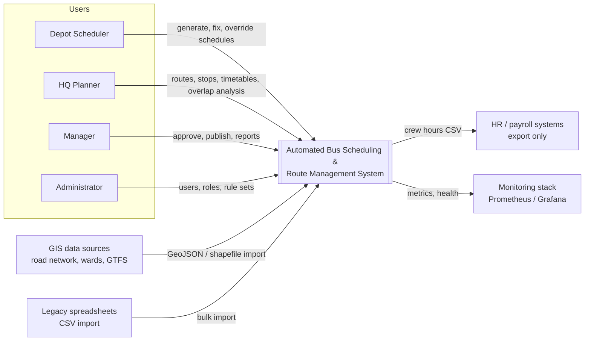
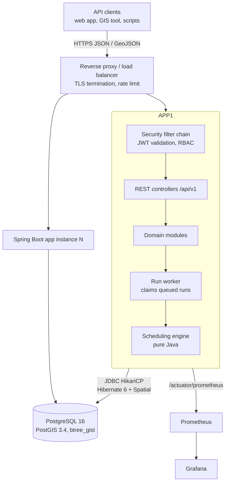
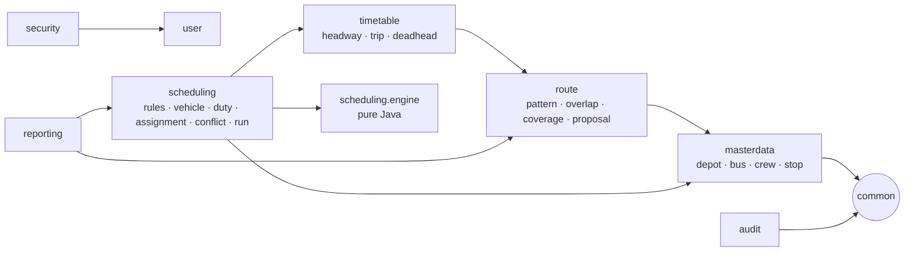
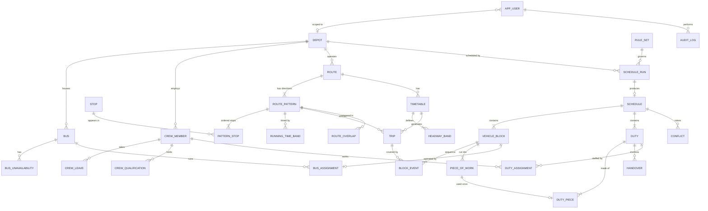
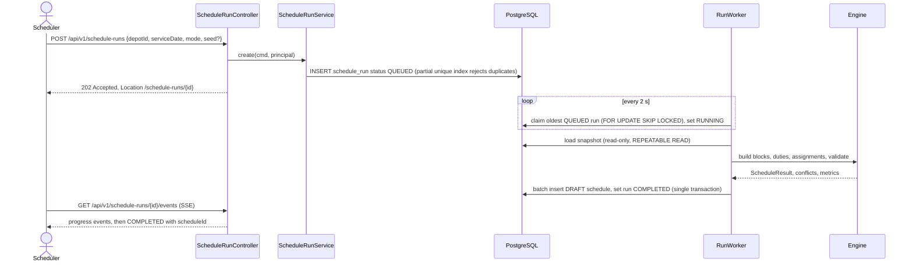
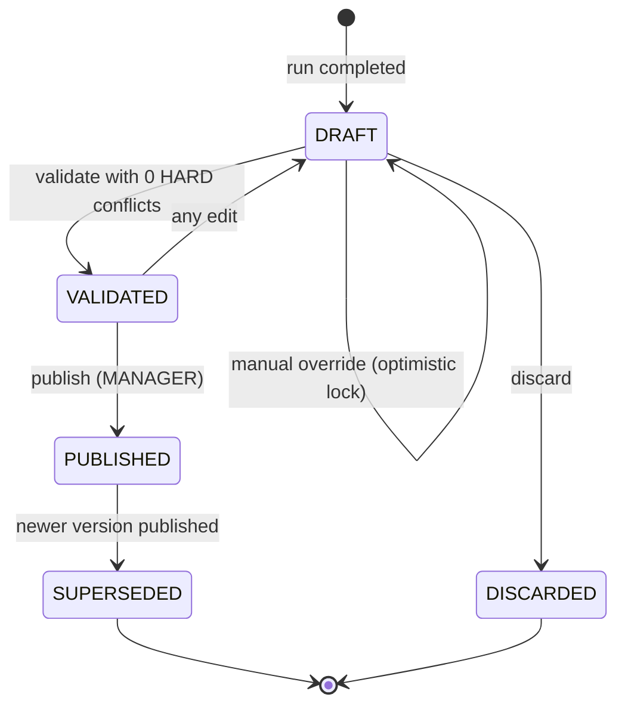
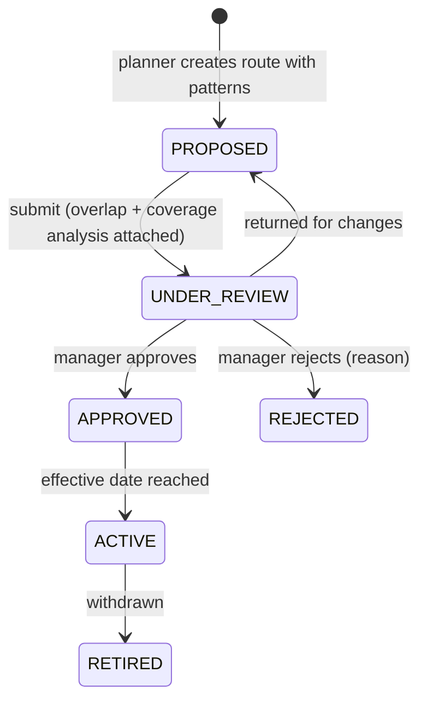
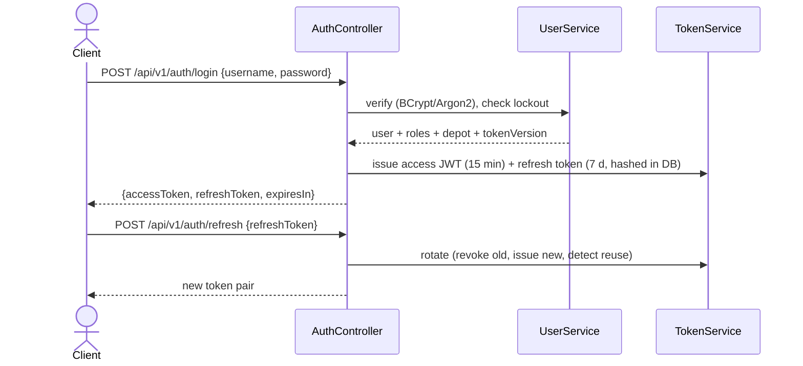
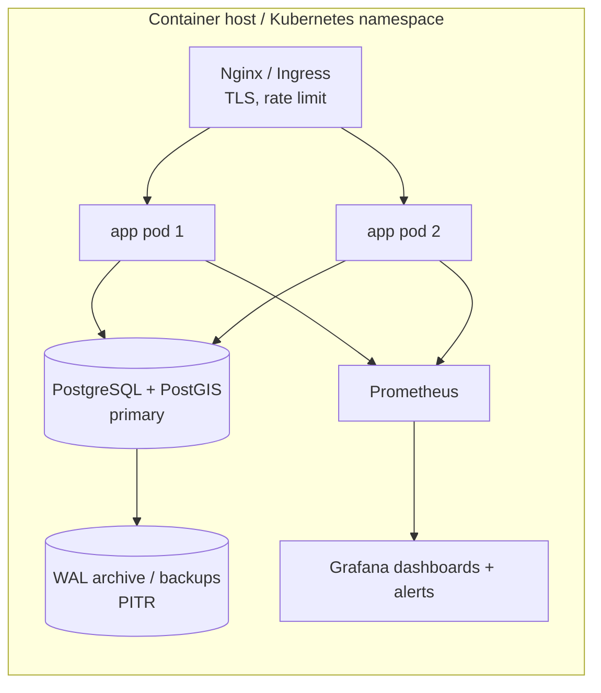

# Architecture — Automated Bus Scheduling & Route Management System (DTC)

> Related: [Project statement](Project%20statement.md) · [Implementation](Implementation.md) · [Edge cases](Edge%20case.md) · [Evaluation](Evaluation.md)

---

## 1. Architectural overview

### 1.1 Style: modular monolith

The system is a **single Spring Boot application with strictly separated domain modules**, backed by **PostgreSQL + PostGIS**.

| Option considered | Verdict | Reason |
|---|---|---|
| Microservices | Rejected for v1 | Scheduling needs strongly consistent reads across master data, timetables and assignments. Distributed transactions and data duplication would add risk without benefit at this team size. |
| **Modular monolith** | **Chosen** | One deployable and ACID transactions. Module boundaries are enforced by package structure and ArchUnit tests. Any module can be extracted later if needed. |
| Monolith without boundaries | Rejected | The scheduling engine would become entangled with JPA and web code, making it hard to test and optimise. |

### 1.2 Guiding principles

1. **Engine is pure Java.** Scheduling algorithms operate on immutable in-memory records with no Spring, JPA or HTTP dependencies. Adapters load a snapshot and persist results. This keeps the engine deterministic, fast and unit-testable.
2. **Constraints are data, not code branches.** Labour and operational rules live in versioned **rule sets** so they can change without redeploying.
3. **Explain, don't hide.** When the engine cannot satisfy a constraint it emits a typed **conflict** with reasons. It never silently relaxes a hard rule.
4. **Database as last line of defence.** Exclusion constraints, partial unique indexes and check constraints guarantee invariants even if application code has a bug or requests race.
5. **Geospatial work happens in PostGIS.** Spatial indexes and set-based SQL do the geometry math. Java handles validation and orchestration.
6. **Secure by default.** Every endpoint is authenticated unless explicitly public. Authorization is checked at the route level and at method or data level (depot scope).

---

## 2. System context



---

## 3. Container view



- **API instances are stateless.** Tokens are JWTs and no HTTP session is kept.
- **Run workers** in each instance claim queued scheduling runs from the `schedule_run` table using `SELECT … FOR UPDATE SKIP LOCKED`. This works with one instance or many, without a separate message broker.
- A **read replica** can serve reporting endpoints later. v1 uses materialized views on the primary.

---

## 4. Module decomposition

Base package: `com.dtc.transit`



| Module | Responsibility | Key types |
|---|---|---|
| `common` | Shared kernel: paging/filter framework, error handling, base entities, time utilities, geometry helpers | `PageResponse`, `SortWhitelist`, `ProblemDetails`, `ServiceTime`, `GeoJsonCodec` |
| `security` | Authentication, JWT issuing and validation, authorization helpers, depot scoping | `SecurityConfig`, `TokenService`, `DepotAccessEvaluator` |
| `user` | Users, roles, depot binding, token versioning | `AppUser`, `UserService` |
| `masterdata` | Depots, buses, availability windows, crew, leave, qualifications, stops | `Depot`, `Bus`, `CrewMember`, `Stop` |
| `route` | Routes, patterns (geometry), pattern stops, running-time bands, overlap analysis, coverage, proposal workflow | `Route`, `RoutePattern`, `OverlapAnalysisService`, `CoverageService` |
| `timetable` | Timetables, headway bands, trip generation, deadhead matrix, calendar exceptions | `Timetable`, `Trip`, `TripGenerator`, `DeadheadMatrix` |
| `scheduling` | Rule sets, runs, schedules, blocks, pieces, duties, assignments, conflicts, publish and overrides. Holds the adapters between the database and the engine. | `ScheduleRunService`, `ScheduleSnapshotLoader`, `SchedulePersister`, `PublishService` |
| `scheduling.engine` | **Framework-free** algorithms: block building, relief cutting, linked/unlinked duty building, local search, crew assignment, constraint validation | `BlockBuilder`, `DutyBuilder`, `CrewAssigner`, `ConstraintEngine` |
| `reporting` | KPIs, utilization, crew hours, dashboard, CSV export | `ReportService`, materialized views |
| `audit` | Append-only audit log via domain events | `AuditEvent`, `AuditListener` |

**Boundary rules** (enforced by ArchUnit tests):

- `scheduling.engine` must not import `org.springframework..`, `jakarta.persistence..` or any other module's entities.
- Controllers never touch repositories directly. They go through services.
- Modules interact through service interfaces or domain events, never through another module's repositories.

### 4.1 Layering inside a module

```
api/          → @RestController, request/response DTOs, validation annotations
application/  → @Service, transactions, orchestration, authorization checks
domain/       → @Entity aggregates, value objects, domain events, invariants
infra/        → Spring Data repositories, native spatial queries, specifications
```

DTOs are mapped with **MapStruct**. Entities are never serialised directly, which avoids lazy-loading issues and mass-assignment vulnerabilities.

---

## 5. Data architecture

### 5.1 Entity-relationship overview



### 5.2 Core tables

| Table | Key columns | Notes |
|---|---|---|
| `depot` | `id`, `code` (unique), `name`, `location geometry(Point,4326)`, `parking_capacity`, `charging_bays` | |
| `bus` | `id`, `registration_no` (unique, normalised), `fleet_no`, `depot_id`, `bus_type`, `fuel_type`, `is_ac`, `capacity`, `ev_range_km`, `status`, `version` | `status` ∈ ACTIVE, UNDER_MAINTENANCE, BREAKDOWN, RETIRED |
| `bus_unavailability` | `bus_id`, `period tstzrange`, `reason` | GiST index on `(bus_id, period)` |
| `crew_member` | `id`, `employee_code` (unique, text), `name`, `crew_role`, `depot_id`, `licence_no`, `licence_class`, `licence_expiry`, `status`, `weekly_off_dow`, `version` | Depot history is kept in `crew_depot_history` |
| `crew_leave` | `crew_member_id`, `period tstzrange`, `leave_type` | Supports partial days |
| `crew_qualification` | `crew_member_id`, `code` (EV, AC, ROUTE_xxx), `valid_until` | |
| `stop` | `id`, `code`, `name`, `location geometry(Point,4326)`, `is_terminal`, `is_relief_point`, `active` | GiST index |
| `route` | `id`, `route_no`, `name`, `depot_id`, `status`, `effective_from`, `version` | Unique `route_no` among ACTIVE routes (partial index) |
| `route_pattern` | `id`, `route_id`, `direction`, `geom geometry(LineString,4326)`, `geom_utm geometry(LineString,32643)`, `length_m` | GiST on `geom_utm`. See 5.3 |
| `pattern_stop` | `pattern_id`, `seq`, `stop_id`, `dist_from_start_m` | PK `(pattern_id, seq)` |
| `running_time_band` | `pattern_id`, `day_type`, `from_sec`, `to_sec`, `running_sec` | |
| `timetable` | `id`, `route_id`, `day_type`, `valid_from`, `valid_to`, `status` | |
| `headway_band` | `timetable_id`, `direction`, `from_sec`, `to_sec`, `headway_sec` | |
| `trip` | `id`, `timetable_id`, `pattern_id`, `start_stop_id`, `end_stop_id`, `start_sec`, `end_sec`, `distance_m`, `required_vehicle_class` | `start_sec`/`end_sec` count from service-day start and may exceed 86,400 |
| `deadhead` | `from_stop_id`, `to_stop_id`, `from_sec_band`, `travel_sec`, `distance_m`, `estimated` | |
| `calendar_exception` | `service_date`, `depot_id` (nullable), `day_type_override`, `note` | Holidays and events |
| `rule_set` | `id`, `name`, `depot_id` (nullable = global), `effective_from`, `rules jsonb`, `version` | Validated against a typed Java record |
| `schedule_run` | `id uuid`, `depot_id`, `service_date`, `mode`, `rule_set_id`, `seed`, `status`, `claimed_by`, `heartbeat_at`, `progress`, `metrics jsonb`, `error`, `created_by` | Acts as the job queue |
| `schedule` | `id`, `run_id`, `depot_id`, `service_date`, `version_no`, `status`, `needs_revalidation`, `published_at`, `published_by` | |
| `vehicle_block` | `id`, `schedule_id`, `block_no`, `vehicle_class`, `pull_out_sec`, `pull_in_sec`, `service_km`, `dead_km` | |
| `block_event` | `block_id`, `seq`, `type`, `trip_id`, `from_stop_id`, `to_stop_id`, `start_sec`, `end_sec`, `is_relief_opportunity` | `type` ∈ PULL_OUT, TRIP, DEADHEAD, LAYOVER, DEPOT_PARK, CHARGING, PULL_IN |
| `piece_of_work` | `id`, `block_id`, `from_event_seq`, `to_event_seq`, `start_sec`, `end_sec`, `start_relief_stop_id`, `end_relief_stop_id` | |
| `duty` | `id`, `schedule_id`, `duty_no`, `mode`, `duty_type`, `sign_on_sec`, `sign_off_sec`, `platform_sec`, `paid_sec`, `break_sec`, `spread_sec`, `overtime_sec`, `version` | |
| `duty_piece` | `duty_id`, `seq`, `piece_id` (unique) | A piece belongs to at most one duty |
| `handover` | `id`, `schedule_id`, `block_id`, `relief_stop_id`, `at_sec`, `outgoing_duty_id`, `incoming_duty_id` | |
| `duty_assignment` | `id`, `duty_id`, `crew_role`, `crew_member_id`, `service_date`, `work_period tstzrange`, `schedule_status`, `status`, `override_reason`, `version` | **Exclusion constraint** (5.4) |
| `bus_assignment` | `id`, `block_id`, `bus_id`, `period tstzrange`, `schedule_status` | **Exclusion constraint** |
| `conflict` | `id`, `schedule_id`, `type`, `severity`, `entity_refs jsonb`, `message`, `details jsonb`, `resolved`, `resolved_by` | |
| `route_overlap` | `proposed_pattern_id`, `existing_pattern_id`, `overlap_m`, `overlap_ratio`, `shared_stops`, `same_direction`, `severity`, `computed_at` | Cached analysis results |
| `coverage_zone` | `id`, `name`, `zone_type`, `geom geometry(MultiPolygon,4326)`, `geom_utm`, `population` | Wards or grid cells |
| `app_user` | `id`, `username`, `password_hash`, `enabled`, `depot_id`, `token_version`, `failed_logins`, `locked_until` | |
| `user_role` | `user_id`, `role` | |
| `refresh_token` | `id`, `user_id`, `token_hash`, `expires_at`, `revoked`, `replaced_by` | Rotation with reuse detection |
| `audit_log` | `id`, `at`, `actor`, `action`, `entity_type`, `entity_id`, `before jsonb`, `after jsonb`, `reason`, `trace_id` | Append-only. Partitioned by month. |

**Identifiers:** entities use `BIGINT` from **sequences with a pooled allocator** (`allocationSize = 50`). `IDENTITY` is avoided because it disables Hibernate JDBC batching, which matters when a single run writes tens of thousands of rows. `schedule_run` uses UUIDs because its IDs are exposed as job handles.

### 5.3 Spatial storage strategy

| Concern | Decision |
|---|---|
| Interchange CRS | **EPSG:4326** (WGS84 lon/lat), matching GeoJSON |
| Metric CRS | **EPSG:32643** (UTM zone 43N covers Delhi NCR). Lengths, buffers and areas are computed in metres. |
| Storage | `geom` (4326) is the source of truth. `geom_utm` (32643) is a stored generated column, so indexed metric queries never call `ST_Transform` on the fly. |
| Indexes | GiST on `geom_utm` for patterns, stops and zones. GiST on `tstzrange` columns. |
| Java type | JTS `org.locationtech.jts.geom.*` via **Hibernate Spatial** (`hibernate-spatial` module of Hibernate ORM 6) |
| API format | GeoJSON (JTS `GeoJsonReader`/`GeoJsonWriter` in a `GeoJsonCodec`) |
| Validation | `ST_IsValid`, ≥ 2 distinct points, within the configured service-area polygon, simplification with `ST_SimplifyPreserveTopology` (≈ 5 m) for GPS traces |

```sql
CREATE EXTENSION IF NOT EXISTS postgis;
CREATE EXTENSION IF NOT EXISTS btree_gist;

CREATE TABLE route_pattern (
  id         BIGINT PRIMARY KEY DEFAULT nextval('route_pattern_seq'),
  route_id   BIGINT NOT NULL REFERENCES route(id),
  direction  VARCHAR(8) NOT NULL CHECK (direction IN ('UP','DOWN','LOOP')),
  geom       geometry(LineString, 4326) NOT NULL,
  geom_utm   geometry(LineString, 32643)
             GENERATED ALWAYS AS (ST_Transform(geom, 32643)) STORED,
  length_m   DOUBLE PRECISION
             GENERATED ALWAYS AS (ST_Length(ST_Transform(geom, 32643))) STORED,
  version    BIGINT NOT NULL DEFAULT 0,
  CONSTRAINT route_pattern_geom_ok CHECK (ST_IsValid(geom) AND ST_NPoints(geom) >= 2),
  CONSTRAINT route_pattern_dir_uq UNIQUE (route_id, direction)
);
CREATE INDEX route_pattern_geom_utm_gix ON route_pattern USING GIST (geom_utm);
```

> If the target PostGIS build rejects `ST_Transform` in a generated column, maintain `geom_utm` with a `BEFORE INSERT OR UPDATE` trigger instead. The query design is unchanged.

### 5.4 Integrity guarantees in the database

```sql
-- A crew member can never hold two overlapping PUBLISHED duties, across dates and depots
ALTER TABLE duty_assignment
  ADD CONSTRAINT no_crew_double_booking
  EXCLUDE USING gist (crew_member_id WITH =, work_period WITH &&)
  WHERE (schedule_status = 'PUBLISHED' AND status <> 'CANCELLED');

-- A bus can never be in two overlapping PUBLISHED blocks
ALTER TABLE bus_assignment
  ADD CONSTRAINT no_bus_double_booking
  EXCLUDE USING gist (bus_id WITH =, period WITH &&)
  WHERE (schedule_status = 'PUBLISHED');

-- Only one queued/running run per depot and service date
CREATE UNIQUE INDEX one_active_run_per_depot_day
  ON schedule_run (depot_id, service_date)
  WHERE status IN ('QUEUED', 'RUNNING');

-- Only one published schedule per depot and service date
CREATE UNIQUE INDEX one_published_schedule_per_depot_day
  ON schedule (depot_id, service_date)
  WHERE status = 'PUBLISHED';

-- A piece of work is used by at most one duty
ALTER TABLE duty_piece ADD CONSTRAINT duty_piece_once UNIQUE (piece_id);
```

**Why exclusion constraints apply only to `PUBLISHED` rows:** drafts legitimately overlap with the currently published version while a replacement is being prepared. Drafts are validated in the application. The **publish transaction** first flips the old version's rows to `SUPERSEDED`, then flips the new version's rows to `PUBLISHED`. If any cross-schedule overlap slipped through (for example, the previous day's late duty overlapping this day's early duty), the constraint aborts the publish.

`work_period` is an absolute `tstzrange` computed as `service_date 00:00 IST + sign_on_sec … + sign_off_sec`. This makes overlaps across midnight and across service dates detectable.

### 5.5 Time model

| Aspect | Decision |
|---|---|
| Trip and duty times | `INT` seconds from **service-day start** (GTFS style: `25:30:00` = 91,800 s) |
| Absolute instants | `timestamptz`, stored in UTC |
| Presentation | IST (`Asia/Kolkata`, UTC+05:30, no DST) |
| JVM / Hibernate | `hibernate.jdbc.time_zone=UTC`. The service code never calls `LocalDateTime.now()` directly. An injected `Clock` is used everywhere, which keeps tests deterministic. |
| Service-day boundary | Configurable `serviceDayStart` (default 03:00). A trip starting at 00:40 belongs to the previous service date. |

### 5.6 Volume and partitioning *(sizing assumptions)*

| Table | Rows / day | Retention strategy |
|---|---|---|
| `trip` | ~50,000 per day type (not per date) | Per timetable version |
| `block_event` | ~120,000 per published date | Range-partitioned by `service_date` (monthly) |
| `duty_assignment` | ~25,000 per date | Range-partitioned monthly |
| `audit_log` | 10⁴–10⁵ | Range-partitioned monthly, archived after N months |

---

## 6. Scheduling engine

### 6.1 Pipeline

```mermaid
flowchart LR
  S[Snapshot loader<br/>trips, deadheads, buses,<br/>availability, crew, leave,<br/>7-day history, rule set] --> VB
  VB[1 · BlockBuilder<br/>trips → blocks] --> RC
  RC[2 · ReliefOpportunityFinder<br/>mark relief events] --> DB{mode}
  DB -->|LINKED| LD[3a · LinkedDutyBuilder<br/>cut each block in place]
  DB -->|UNLINKED| PC[3b · PieceCutter<br/>blocks → pieces] --> UD[UnlinkedDutyBuilder<br/>pieces → duties] --> LS[LocalSearchImprover]
  LD --> CA
  LS --> CA
  CA[4 · CrewAssigner<br/>duties → named crew] --> BA[5 · BusAssigner<br/>blocks → physical buses]
  BA --> CV[6 · ConstraintEngine<br/>full independent validation]
  CV --> R[ScheduleResult<br/>blocks, duties, handovers,<br/>assignments, conflicts, metrics]
```



Every stage is an interface. Implementations are selected by configuration, which allows alternatives such as a matching-based block builder or a future solver-based duty builder:

```java
public interface BlockBuilder     { VehicleSchedule build(List<TripView> trips, DepotContext ctx, RuleSet rules); }
public interface DutyBuilder      { CrewSchedule build(VehicleSchedule vs, DepotContext ctx, RuleSet rules); }
public interface CrewAssigner     { Roster assign(CrewSchedule cs, CrewPool pool, CrewHistory history, RuleSet rules); }
public interface ConstraintEngine { List<Violation> validate(ScheduleResult result, DepotContext ctx, RuleSet rules); }
```

### 6.2 Stage 1: vehicle scheduling (blocks)

**Goal:** cover all trips with the fewest buses and the least dead running, while respecting vehicle class, minimum layover, deadhead time, EV range and bus availability.

**Default `GreedyBestFitBlockBuilder`:**

1. Sort trips by `(start_sec, id)`.
2. For each trip, find open blocks whose vehicle class satisfies the trip and which can reach the trip's start stop in time:
   `block.end + minLayover(block.lastTrip) + deadhead(block.endStop → trip.startStop) ≤ trip.start`
3. Among feasible blocks, choose the one with **minimum slack** (best fit), which keeps idle gaps small. Also check EV cumulative km against `range × (1 − reserve)` and the maximum block duration.
4. If slack exceeds `midDayDepotReturnGap`, insert `PULL_IN → DEPOT_PARK → PULL_OUT` events (plus a `CHARGING` event for EVs).
5. If there is no feasible block and a vehicle of the class is still available, open a new block. Otherwise, record `UNCOVERED_TRIP` with the reason.

Complexity is O(T·B) per depot (≈1,500 trips × ≈150 blocks), well under a second.

**Optional `MinFleetMatchingBlockBuilder`:** build a compatibility DAG (edge i→j if trip j can follow trip i) with edges pruned to a time window. Minimum fleet = T − maximum bipartite matching (Hopcroft–Karp, O(E√V)). This gives the **optimal PVR** under the model and is used both as an alternative builder and as a **lower bound** in [Evaluation](Evaluation.md).

### 6.3 Stage 2: relief opportunities

A block event is a relief opportunity if it ends at a stop with `is_relief_point = true` or at the depot, and the stop's arrival leaves at least `handoverBufferMin` before the next departure. Pull-out and pull-in are always relief opportunities.

### 6.4 Stage 3a: linked duties

The crew stays with one bus.

```
for each block:
    reliefs = relief opportunities in time order (includes pull-out and pull-in)
    cursor = 0
    while cursor < last(reliefs):
        feasible = { j > cursor : segment(cursor, j) satisfies all hard duty rules }
        if feasible is empty:
            emit duty(cursor, cursor+1) with HARD conflict NO_FEASIBLE_RELIEF
            cursor = cursor + 1
        else:
            j* = argmin over feasible of |work(cursor, j) − targetWork|
                 + penalty if remainder(j, last) < minPaidDuty      // avoid tiny tail duties
            emit linked duty(cursor, j*); record handover at reliefs[j*] if j* < last
            cursor = j*
```

- **Break rule:** within the segment, a layover of at least `minBreakMin` must occur before continuous work exceeds `maxContinuousWorkMin`. If no such layover exists, the segment is infeasible.
- **Split linked duty:** when the bus parks at the depot midday, the same crew may cover the morning and evening portions of that bus, provided spread-over allows.
- Hard constraints are **not monotone** in segment length (a long layover later can satisfy the break rule), so all candidate end points are checked rather than stopping at the first failure.

### 6.5 Stage 3b: unlinked duties

The crew may change buses at relief points.

**Piece cutting (dynamic programming per block):** choose cut points among relief opportunities so that each piece length lies in `[minPieceMin, maxContinuousWorkMin]`, minimising the number of pieces and preferring cuts at depot or major relief points. Complexity O(R²) per block.

**Greedy duty construction:**

```
unassigned = all pieces sorted by start
while unassigned not empty:
    duty = new Duty(first(unassigned))
    loop:
        candidates = { q in unassigned :
            q.start ≥ duty.end + transfer(duty.endRelief → q.startRelief) + handoverBuffer
            and rules.hardOk(duty + q)          // work, spread-over, break owed, max pieces, max changeovers
        }
        if candidates empty: break
        q = argmin cost(duty, q)                // small idle gap, same relief point,
                                                // gap ≥ minBreak if a break is still owed
        duty.add(q)
    finalize(duty)                              // sign-on/off, travel to/from depot, classify type
```

**Local search improvement** (time-bounded, seeded `SplittableRandom`):

| Move | Description |
|---|---|
| `MovePiece` | Move a piece from duty A to duty B |
| `SwapPieces` | Exchange pieces between two duties |
| `MergeDuties` | Merge two short duties into one when feasible |
| `SplitDuty` | Split an over-long duty to remove overtime |
| `ReCut` | Shift a block's cut point to a neighbouring relief opportunity |

A move is accepted if all hard constraints hold and the cost decreases. Simulated-annealing acceptance is an optional setting. The search stops at the time budget or after K non-improving iterations.

**Cost function** (weights come from the rule set):

```
cost = w_duty     · #duties
     + w_paid     · Σ paidTime
     + w_idle     · Σ (paidTime − platformTime − paidBreaks − signOnOff)
     + w_overtime · Σ overtime
     + w_split    · #splitDuties
     + w_change   · Σ busChangeovers
     + w_soft     · Σ softViolationPenalty
```

> **Future option:** replace or augment `UnlinkedDutyBuilder` with a set-partitioning model solved through column generation (for example with OR-Tools). The interface already allows that swap.

### 6.6 Stage 4: crew assignment

1. **Build slots:** one slot per duty × required role (driver, plus conductor if needed).
2. **Order by difficulty:** fewest eligible candidates first (MRV heuristic), ties broken by earlier sign-on. Counts are recomputed after every N bookings.
3. **Hard eligibility filter.** Each rejection records a reason code:
   `WRONG_DEPOT`, `WRONG_ROLE`, `INACTIVE`, `ON_LEAVE`, `WEEKLY_OFF`, `LICENCE_INVALID`, `QUALIFICATION_MISSING`, `INSUFFICIENT_REST`, `WEEKLY_HOURS_EXCEEDED`, `WEEKLY_REST_MISSING`, `ALREADY_BOOKED`.
4. **Score eligible candidates:** lower is better.
   `score = a·(weeklyHours/weeklyMax) + b·sameShiftTypeStreak + c·nightDutiesLast28d − d·pairContinuity − e·seniorityPreference`
5. **Book** the best candidate and update their in-memory history. If nobody is eligible, emit `UNASSIGNED_DUTY` with an aggregated reason histogram (for example "18 drivers: 9 INSUFFICIENT_REST, 6 ON_LEAVE, 3 LICENCE_INVALID").
6. Unused eligible crew are placed into **standby duties** up to `standbyPoolPct`.

### 6.7 Constraint engine and rule sets

Constraints implement a common interface and are registered in a catalogue:

```java
public interface Constraint<T> {
    String code();                 // e.g. "MAX_CONTINUOUS_WORK"
    Severity severity();           // HARD or SOFT
    Scope scope();                 // BLOCK, DUTY, ASSIGNMENT, SCHEDULE
    List<Violation> check(T subject, ValidationContext ctx);
}
```

The same catalogue is used **during construction** (fast incremental checks) and in **final validation** (a full re-check from scratch). Evaluation also runs an **independent SQL invariant suite** (see [Evaluation](Evaluation.md)).

**Default rule set.** Every value is configurable. Statutory values must be verified against the rules currently in force.

| Key | Default | Severity | Basis |
|---|---|---|---|
| `maxWorkPerDutyMin` | 480 | HARD | ≤ 8 h/day (MTW Act baseline) |
| `maxContinuousWorkMin` | 300 | HARD | ≤ 5 h before a rest interval |
| `minBreakMin` | 30 | HARD | Rest interval ≥ 30 min |
| `maxSpreadOverMin` | 720 | HARD | Spread-over ≤ 12 h |
| `maxWeeklyWorkMin` | 2880 | HARD | ≤ 48 h/week (rolling 7 days) |
| `weeklyRestDays` | 1 per 7 | HARD | Weekly rest day |
| `minRestBetweenDutiesMin` | 600 | HARD | *Assumption*, to be confirmed with DTC |
| `signOnMin` / `signOffMin` | 15 / 10 | Parameter | *Assumption* |
| `minLayoverMin` | max(5, 10 % of running time) | HARD (ops) | *Assumption* |
| `handoverBufferMin` | 5 | HARD (ops) | *Assumption* |
| `maxPiecesPerDuty` | 3 | SOFT | *Assumption* |
| `maxBusChangeoversPerDuty` | 2 | SOFT | *Assumption* |
| `targetWorkPerDutyMin` | 450 | SOFT | Efficiency target |
| `minPaidDutyMin` | 240 | SOFT | Minimum paid guarantee *(assumption)* |
| `allowOvertime` / `maxOvertimeMin` | false / 60 | HARD when enabled | Policy |
| `midDayDepotReturnGapMin` | 90 | Parameter | *Assumption* |
| `evRangeReservePct` | 15 | HARD | Battery safety margin |
| `standbyPoolPct` | 5 | Parameter | *Assumption* |
| `serviceDayStart` | 03:00 | Parameter | |

The rule set is stored as `jsonb` and bound to a typed Java `record RuleSet(...)` with Bean Validation. The rule set that applies is the one whose `effective_from` is the latest date on or before the service date (depot-specific first, then global).

### 6.8 Conflict catalogue

| Type | Severity | Raised when |
|---|---|---|
| `UNCOVERED_TRIP` | HARD | A trip is in no block |
| `BUS_DOUBLE_BOOKED` | HARD | Overlapping bus assignments |
| `BUS_UNAVAILABLE` | HARD | A block is assigned to a bus that is in maintenance or broken down |
| `EV_RANGE_EXCEEDED` | HARD | Block km exceeds usable range without a charging event |
| `NO_FEASIBLE_RELIEF` | HARD | Work between relief opportunities exceeds the limit |
| `MAX_WORK_EXCEEDED` | HARD | Duty work > max |
| `CONTINUOUS_WORK_EXCEEDED` | HARD | No qualifying break in time |
| `SPREAD_OVER_EXCEEDED` | HARD | Spread-over > max |
| `HANDOVER_INFEASIBLE` | HARD | Gap < transfer + buffer, or relief point mismatch |
| `CREW_DOUBLE_BOOKED` | HARD | Overlapping crew work periods |
| `INSUFFICIENT_REST` | HARD | Rest between duties < min |
| `WEEKLY_HOURS_EXCEEDED` | HARD | Rolling 7-day work > max |
| `WEEKLY_REST_MISSING` | HARD | No rest day in the rolling 7 days |
| `LICENCE_INVALID` | HARD | Licence expired or wrong class on the service date |
| `CREW_ON_LEAVE` | HARD | Assigned during leave |
| `QUALIFICATION_MISSING` | HARD | e.g. an EV duty without EV training |
| `UNASSIGNED_DUTY` | HARD | No eligible crew |
| `TOO_MANY_CHANGEOVERS` | SOFT | Changeovers > max |
| `SHORT_DUTY` | SOFT | Paid time < minimum guarantee |
| `FAIRNESS_IMBALANCE` | SOFT | Hours or night duties skewed beyond threshold |
| `ESTIMATED_DEADHEAD` | SOFT | Deadhead time was estimated, not measured |

### 6.9 Run execution



- **Heartbeat and reaper:** workers update `heartbeat_at` every 10 s. A reaper marks runs `FAILED` (with reason `WORKER_LOST`) if the heartbeat is older than 2 minutes.
- **Atomic results:** everything a run produces is written in one transaction, so a crash leaves no partial schedule.
- **Parallelism:** a bounded executor processes depot-days concurrently (pool size = cores − 1). The engine is CPU-bound and single-threaded per run.
- **Determinism:** the seed is stored on the run, and collections are iterated in a stable order (sorted lists, never `HashMap` iteration order).

### 6.10 Schedule lifecycle



A published schedule is immutable. If master data changes later (a bus breaks down, leave is approved, a licence expires), a **revalidation job** sets `needs_revalidation = true` and records new conflicts. Resolving them requires a new version, which can be created as a copy of the published version and then edited.

---

## 7. Route management and geospatial design

### 7.1 Proposal lifecycle



### 7.2 Overlap detection

**Definition:** the overlap between proposed pattern P and existing pattern E is the length of P that lies within `bufferM` (default 25 m) of E, counting only contiguous segments of at least `minSegmentM` (default 200 m). Short segments are discarded because they are usually crossings at junctions.

```sql
WITH proposed AS (
  SELECT ST_Transform(ST_SetSRID(ST_GeomFromGeoJSON(:geojson), 4326), 32643) AS g
),
candidates AS (                                   -- index-assisted prefilter
  SELECT rp.id, rp.route_id, rp.direction, rp.geom_utm
  FROM route_pattern rp, proposed p
  WHERE ST_DWithin(rp.geom_utm, p.g, :bufferM)
    AND rp.id <> COALESCE(:excludePatternId, -1)
),
segments AS (
  SELECT c.id AS pattern_id, c.route_id, c.direction, d.geom AS seg
  FROM candidates c, proposed p,
       LATERAL ST_Dump(
         ST_Intersection(p.g, ST_Buffer(c.geom_utm, :bufferM, 'endcap=flat join=round'))
       ) d
)
SELECT s.pattern_id,
       r.route_no,
       s.direction,
       SUM(ST_Length(s.seg))                                        AS overlap_m,
       SUM(ST_Length(s.seg)) / (SELECT ST_Length(g) FROM proposed)  AS overlap_ratio
FROM segments s
JOIN route r ON r.id = s.route_id AND r.status = 'ACTIVE'
WHERE ST_Length(s.seg) >= :minSegmentM
GROUP BY s.pattern_id, r.route_no, s.direction
ORDER BY overlap_m DESC;
```

The query result is enriched in Java with:

- **Shared stops:** proposed stops within 30 m of a stop on the existing pattern.
- **Direction agreement:** compare `ST_LineLocatePoint` ordering of the segment's endpoints on both lines. This separates same-direction duplication from the opposite direction on the same corridor.
- **Severity:** `HIGH` when ratio ≥ 0.60, `MEDIUM` when 0.30–0.60, `LOW` otherwise (thresholds configurable).
- **Corridor view:** the union of all overlapping segments, returned as GeoJSON for map display.

**Self-overlap and loops:** proposed geometries are normalised with `ST_LineMerge(ST_UnaryUnion(g))` before length computation, so a route that goes out and back along the same road is not double counted.

### 7.3 Coverage analysis

- **Catchment:** each active stop is buffered by `catchmentRadiusM` (default 500 m) in EPSG:32643.
- **Scalable approach:** zones are stored as **grid cells** (for example 250 m squares) plus administrative wards. A materialized view `cell_coverage(cell_id, covered boolean, nearest_stop_m)` is refreshed with `REFRESH MATERIALIZED VIEW CONCURRENTLY` whenever stops change. This avoids intersecting one huge unioned polygon on every request.
- **Zone coverage:** `covered_ratio = Σ area(covered cells ∩ zone) / area(zone)`, population-weighted when population data exists.
- **Coverage gain of a proposal:** cells newly covered by the proposed pattern's stops that are not covered today, reported as area and, where available, population.

```sql
SELECT z.id, z.name, z.population,
       SUM(ST_Area(ST_Intersection(c.geom_utm, z.geom_utm))) FILTER (WHERE cc.covered)
         / ST_Area(z.geom_utm) AS covered_ratio
FROM coverage_zone z
JOIN grid_cell c        ON ST_Intersects(c.geom_utm, z.geom_utm)
JOIN cell_coverage cc   ON cc.cell_id = c.id
WHERE z.zone_type = 'WARD'
GROUP BY z.id
HAVING SUM(ST_Area(ST_Intersection(c.geom_utm, z.geom_utm))) FILTER (WHERE cc.covered)
         / ST_Area(z.geom_utm) < :maxRatio
ORDER BY covered_ratio;
```

### 7.4 Hibernate Spatial usage

- Entities map JTS types directly, e.g. `@Column(columnDefinition = "geometry(LineString,4326)") private LineString geom;`.
- Simple spatial filters (bounding box, near point) use HQL spatial functions in Spring Data specifications or `@Query`.
- Complex analytics (overlap, coverage) use **native SQL with interface projections**. That SQL is kept in `infra/` and covered by Testcontainers integration tests.

---

## 8. Security architecture

### 8.1 Authentication



- **Resource server:** `spring-boot-starter-oauth2-resource-server` validates self-issued **RS256** JWTs (Nimbus). Keys are rotated using a `kid` header.
- **Claims:** `sub`, `roles` (e.g. `["SCHEDULER"]`), `depot` (nullable), `tv` (token version), `iat`, `exp`, `jti`.
- **Revocation:** disabling a user or changing their roles increments `token_version`. A lightweight filter compares `tv` with a cached value (Caffeine, 60 s), so the change applies within minutes and never later than the access-token lifetime. Refresh-token reuse revokes the whole token family.
- **Brute-force protection:** per-IP and per-username rate limiting (Bucket4j). Lockout after 5 failures for 15 minutes.
- **Passwords:** `DelegatingPasswordEncoder` (Argon2 or BCrypt), with minimum length and breached-password checks (optional).

### 8.2 Authorization model

Authorization is enforced at **three levels**:

1. **URL level** in `SecurityFilterChain` (coarse, deny by default).
2. **Method level** with `@PreAuthorize` on application services (fine-grained, also protects non-HTTP entry points).
3. **Data level (depot scope):** a `DepotScope` derived from the JWT is applied to every query specification. For single-entity access, `@depotAccess.canAccess(...)` is used. Out-of-scope entities return **404**, not 403, so IDs cannot be enumerated.

### 8.3 Permission matrix

| Capability | ADMIN | MANAGER | PLANNER | SCHEDULER |
|---|:-:|:-:|:-:|:-:|
| Manage users and roles | ✅ | – | – | – |
| Edit rule sets | ✅ | 👁 | 👁 | 👁 |
| Create/edit depots | ✅ | 👁 | 👁 | 👁 |
| Create/edit buses | ✅ | ✅ (own depot*) | 👁 | 👁 (own depot) |
| Change bus status (maintenance/breakdown) | ✅ | ✅ | – | ✅ (own depot) |
| Create/edit crew | ✅ | ✅ (own depot*) | – | 👁 (own depot) |
| Record crew leave | ✅ | ✅ | – | ✅ (own depot) |
| Create/edit stops | ✅ | 👁 | ✅ | 👁 |
| Create/edit route proposals | ✅ | 👁 | ✅ | 👁 |
| Run overlap / coverage analysis | ✅ | ✅ | ✅ | – |
| Approve/reject route proposals | ✅ | ✅ | – | – |
| Timetables and trip generation | ✅ | 👁 | ✅ | 👁 |
| Start scheduling runs | ✅ | ✅ | – | ✅ (own depot) |
| View schedules, duties, conflicts | ✅ | ✅ | 👁 | ✅ (own depot) |
| Manual assignment override | ✅ | ✅ | – | ✅ (own depot) |
| Override SOFT rule with reason | ✅ | ✅ | – | – |
| Validate schedule | ✅ | ✅ | – | ✅ (own depot) |
| Publish schedule | ✅ | ✅ | – | – |
| Reports and dashboard | ✅ | ✅ | ✅ (route reports) | ✅ (own depot) |
| Audit log | ✅ | ✅ (own depot*) | – | – |

✅ full · 👁 read-only · – no access · *a depot-bound manager is restricted to their depot, while an HQ manager (no depot) sees all depots.

**HARD statutory constraints cannot be overridden by any role.**

### 8.4 Other security controls

| Threat (OWASP API Top 10 2023) | Control |
|---|---|
| API1 Broken object-level authorization | Depot scope in every specification, 404 on out-of-scope, integration tests per role |
| API2 Broken authentication | Short-lived RS256 JWT, refresh rotation, lockout, rate limiting |
| API3 Broken object-property-level authorization | Separate request DTOs per operation (no `status`, `depotId` or `version` mass assignment). Response DTOs mask PII by role. |
| API4 Unrestricted resource consumption | Max page size 100, request body size limit, geometry vertex cap, run queue limits per user, rate limiting |
| API5 Broken function-level authorization | Deny by default, `@PreAuthorize` on services, matrix tests |
| API6 Sensitive business flows | Publish and approve restricted to MANAGER. Idempotency keys on run creation. |
| API8 Security misconfiguration | Actuator restricted to `health`/`info` publicly and the rest to an internal network. Strict CORS allow-list. Security headers. |
| API9 Improper inventory | OpenAPI generated from code. Only `/api/v1` is exposed. |
| Data protection | TLS, least-privilege DB role (no DDL at runtime except Flyway role), no secrets in the repository, PII masking in logs, append-only audit table (UPDATE/DELETE revoked) |

---

## 9. API design

### 9.1 Conventions

| Aspect | Convention |
|---|---|
| Base path | `/api/v1` |
| Format | JSON. Geometries as GeoJSON `Feature` / `FeatureCollection`. |
| Naming | Plural nouns, kebab-case paths, camelCase JSON |
| Long operations | `202 Accepted` + `Location` header, then poll the resource or subscribe to SSE |
| Idempotency | `Idempotency-Key` header on `POST /schedule-runs` and `POST /schedules/{id}/publish` |
| Concurrency | `ETag` from `version`. `If-Match` required on `PATCH`/`PUT` of editable aggregates. `412` or `409` on mismatch. |
| Errors | RFC 7807 `ProblemDetail` with `type`, `title`, `status`, `detail`, `instance`, `traceId`, `errors[]` |
| Times | ISO-8601 with offset for instants. `HH:mm:ss` (can exceed 24) for service-day times. |

### 9.2 Pagination, filtering and sorting

**Offset pagination (default):**

```
GET /api/v1/buses?depotId=12&status=ACTIVE&fuelType=ELECTRIC&q=DL1P&page=0&size=20&sort=fleetNo,asc
```

```json
{
  "content": [ { "id": 101, "registrationNo": "DL1PD1234", "fleetNo": "E-0421", "status": "ACTIVE" } ],
  "page": 0,
  "size": 20,
  "totalElements": 612,
  "totalPages": 31,
  "sort": ["fleetNo,asc", "id,asc"]
}
```

- Default size 20, **max size 100** (larger values are clamped). Negative page returns 400. A page beyond the end returns empty content.
- **Sort whitelist per resource.** A tiebreaker `id` is always appended for stable ordering. Unknown fields return 400.
- **Filters** are typed query parameters bound to a filter record (`BusFilter`, `DutyFilter`…) and converted into JPA `Specification`s. Ranges use `from`/`to` pairs, validated so that `from ≤ to`. Enum values are validated with the allowed values listed in the error.
- **Spatial filters:** `bbox=minLon,minLat,maxLon,maxLat` and `near=lon,lat&radiusM=500`.
- **`includeTotal=false`** skips the count query on very large tables (the response returns a `Slice`, with `hasNext`).

**Keyset (cursor) pagination** for high-volume, append-heavy collections (`trips`, `block events`, `audit-logs`, `duty-assignments`):

```
GET /api/v1/audit-logs?entityType=DUTY_ASSIGNMENT&limit=100&cursor=eyJhdCI6IjIwMjYtMDktMTZUMTA6MDA6MDBaIiwiaWQiOjk4NzY1fQ
```

The cursor is an opaque, Base64-encoded `(sortKey, id)` pair. Queries use `WHERE (at, id) < (:at, :id) ORDER BY at DESC, id DESC LIMIT :limit`.

### 9.3 Endpoint catalogue

"P/F" marks endpoints with pagination and filtering.

| # | Method | Path | Purpose | Roles | P/F |
|---|---|---|---|---|:-:|
| 1 | POST | `/auth/login` | Obtain token pair | public | |
| 2 | POST | `/auth/refresh` | Rotate tokens | public (refresh token) | |
| 3 | POST | `/auth/logout` | Revoke refresh token family | authenticated | |
| 4 | GET | `/users` | List users (role, depot, enabled) | ADMIN | ✅ |
| 5 | POST | `/users` | Create user | ADMIN | |
| 6 | PATCH | `/users/{id}` | Change roles, depot, enabled | ADMIN | |
| 7 | GET | `/depots` | List depots | all | ✅ |
| 8 | POST | `/depots` | Create depot | ADMIN | |
| 9 | GET | `/buses` | List buses (depot, status, type, fuel, AC, q) | all (scoped) | ✅ |
| 10 | POST | `/buses` | Create bus | ADMIN, MANAGER | |
| 11 | PATCH | `/buses/{id}/status` | Maintenance/breakdown with period | ADMIN, MANAGER, SCHEDULER | |
| 12 | GET | `/crew` | List crew (role, depot, status, licenceExpiringBefore, availableOn, qualification) | ADMIN, MANAGER, SCHEDULER | ✅ |
| 13 | POST | `/crew` | Create crew member | ADMIN, MANAGER | |
| 14 | POST | `/crew/{id}/leaves` | Record leave | ADMIN, MANAGER, SCHEDULER | |
| 15 | GET | `/crew/{id}/duties` | Crew duty history (date range) | ADMIN, MANAGER, SCHEDULER | ✅ |
| 16 | GET | `/stops` | List stops (bbox, near, terminal, reliefPoint, q) | all | ✅ |
| 17 | POST | `/stops` | Create stop | ADMIN, PLANNER | |
| 18 | GET | `/routes` | List routes (routeNo, depot, status, bbox, passesNear) | all | ✅ |
| 19 | GET | `/routes/{id}` | Route with patterns as GeoJSON | all | |
| 20 | POST | `/routes` | Create route proposal with patterns | ADMIN, PLANNER | |
| 21 | PUT | `/routes/{id}/patterns/{direction}` | Replace pattern geometry and stops | ADMIN, PLANNER | |
| 22 | POST | `/routes/overlap-analysis` | Ad-hoc overlap for a GeoJSON geometry | ADMIN, MANAGER, PLANNER | |
| 23 | GET | `/routes/{id}/overlaps` | Stored overlaps (minRatio, severity, direction) | ADMIN, MANAGER, PLANNER | ✅ |
| 24 | POST | `/routes/{id}/submit` | Submit proposal for review | ADMIN, PLANNER | |
| 25 | POST | `/routes/{id}/decision` | Approve/reject with reason | ADMIN, MANAGER | |
| 26 | GET | `/coverage/zones` | Zone coverage (zoneType, maxRatio) | ADMIN, MANAGER, PLANNER | ✅ |
| 27 | POST | `/timetables` | Create timetable with headway bands | ADMIN, PLANNER | |
| 28 | POST | `/timetables/{id}/generate-trips` | Generate trips | ADMIN, PLANNER | |
| 29 | GET | `/trips` | List trips (route, depot, dayType, startFrom/To), keyset | ADMIN, PLANNER, SCHEDULER, MANAGER | ✅ |
| 30 | GET | `/rule-sets` | List rule sets | all | ✅ |
| 31 | PUT | `/rule-sets/{id}` | Update rule set (new version) | ADMIN | |
| 32 | POST | `/schedule-runs` | Start run (depot, date, mode, seed) | ADMIN, MANAGER, SCHEDULER | |
| 33 | GET | `/schedule-runs/{id}` | Run status, metrics | ADMIN, MANAGER, SCHEDULER | |
| 34 | GET | `/schedule-runs/{id}/events` | SSE progress stream | ADMIN, MANAGER, SCHEDULER | |
| 35 | GET | `/schedules` | List schedules (depot, date range, status, mode) | ADMIN, MANAGER, SCHEDULER | ✅ |
| 36 | GET | `/schedules/{id}/blocks` | Blocks (busId, vehicleClass, unassigned) | ADMIN, MANAGER, SCHEDULER | ✅ |
| 37 | GET | `/schedules/{id}/duties` | Duties (dutyType, signOnFrom/To, unassigned, crewId, overtime) | ADMIN, MANAGER, SCHEDULER | ✅ |
| 38 | GET | `/schedules/{id}/handovers` | Handovers (reliefStop, time range) | ADMIN, MANAGER, SCHEDULER | ✅ |
| 39 | PATCH | `/duty-assignments/{id}` | Manual override (If-Match) | ADMIN, MANAGER, SCHEDULER | |
| 40 | POST | `/schedules/{id}/validate` | Full validation | ADMIN, MANAGER, SCHEDULER | |
| 41 | GET | `/schedules/{id}/conflicts` | Conflicts (type, severity, resolved) | ADMIN, MANAGER, SCHEDULER | ✅ |
| 42 | POST | `/schedules/{id}/publish` | Publish (0 HARD conflicts) | ADMIN, MANAGER | |
| 43 | GET | `/reports/fleet-utilization` | PVR, in-service ratio, dead km (depot, date range) | ADMIN, MANAGER, SCHEDULER | ✅ |
| 44 | GET | `/reports/crew-hours` | Hours, overtime, nights (crew, depot, week) | ADMIN, MANAGER, SCHEDULER | ✅ |
| 45 | GET | `/reports/schedule-kpis` | Duties, platform/paid, splits, conflicts | ADMIN, MANAGER | ✅ |
| 46 | GET | `/reports/route-overlaps` | Network overlap summary | ADMIN, MANAGER, PLANNER | ✅ |
| 47 | GET | `/dashboard/today` | Real-time operations snapshot | ADMIN, MANAGER, SCHEDULER | |
| 48 | GET | `/audit-logs` | Audit trail (actor, entity, action, time), keyset | ADMIN, MANAGER | ✅ |

**Total: 48 endpoints, 22 of them paginated and filterable.** All paths are relative to `/api/v1`.

---

## 10. Cross-cutting concerns

| Concern | Approach |
|---|---|
| Validation | Bean Validation on DTOs. Domain invariants live in aggregates. Geometry validation is done in `GeoJsonCodec` and again by DB check constraints. |
| Error handling | `@RestControllerAdvice` maps exceptions to `ProblemDetail`: validation → 400, not found or out of scope → 404, optimistic lock → 409, precondition → 412, business rule → 422, rate limit → 429 |
| Transactions | Service-layer `@Transactional`. `spring.jpa.open-in-view=false`. Read-only transactions for queries. Snapshot loads use `REPEATABLE READ`. |
| Optimistic locking | `@Version` on `Bus`, `CrewMember`, `Route`, `RoutePattern`, `Duty`, `DutyAssignment`, `RuleSet` |
| Performance | JDBC batching (`batch_size=500`, ordered inserts), DTO projections and entity graphs to avoid N+1, HikariCP tuning, Caffeine cache for rule sets and reference data, materialized views for reports |
| Concurrency | Virtual threads for request handling (`spring.threads.virtual.enabled=true`). A bounded platform-thread pool runs CPU-bound engine work. |
| Auditing | Domain events → `@TransactionalEventListener(BEFORE_COMMIT)` writes `audit_log` in the same transaction. Spring Data `@CreatedBy`/`@LastModifiedBy`. |
| Observability | Micrometer metrics (`scheduling.run.duration`, `scheduling.conflicts{type}`, `route.overlap.query.duration`), a correlation ID filter placed in MDC, JSON logs, `/actuator/health/liveness` and `/readiness` |
| Configuration | Profiles `local`, `test`, `prod`. Secrets through environment variables or a secret manager. Type-safe `@ConfigurationProperties`. |
| Migrations | Flyway (`V{n}__description.sql`), run by a separate migration DB role at startup or as a pipeline step |
| Documentation | springdoc-openapi (`/v3/api-docs`, Swagger UI in non-prod) |
| Architecture tests | ArchUnit rules for module boundaries and engine purity |

---

## 11. Deployment view



- **Image:** layered Spring Boot jar on a JRE 21 base image, run as a non-root user.
- **Local development:** `docker compose` with `postgis/postgis:16-3.4`.
- **Health probes:** liveness and readiness through Actuator. Readiness also checks database connectivity and Flyway state.
- **Scaling:** add app replicas. Run workers coordinate through `SKIP LOCKED`.
- **Backups:** daily base backup plus WAL archiving. Restores are tested quarterly.

---

## 12. Technology stack

| Layer | Technology | Purpose |
|---|---|---|
| Language | Java 21 (LTS) | Records, sealed types, virtual threads |
| Framework | Spring Boot 3.x | Web, DI, configuration, Actuator |
| Security | Spring Security 6, OAuth2 Resource Server (JWT), Bucket4j | Authentication, RBAC, rate limiting |
| Persistence | Spring Data JPA, Hibernate ORM 6, **Hibernate Spatial**, JTS | ORM with geometry types |
| Database | **PostgreSQL 16**, **PostGIS 3.4**, `btree_gist` | Relational + spatial + exclusion constraints |
| Migrations | Flyway | Versioned schema |
| Mapping | MapStruct | DTO ↔ entity |
| API docs | springdoc-openapi | OpenAPI 3 |
| Caching | Caffeine | Rule sets, reference data, token versions |
| Observability | Micrometer, Prometheus, Grafana | Metrics and alerts |
| Testing | JUnit 5, AssertJ, Mockito, **Testcontainers (PostGIS)**, jqwik (property-based), ArchUnit, Spring Security Test, k6 or Gatling (load) | Quality gates |
| Build / run | Maven, Docker, Docker Compose | Build and environments |

---

## 13. Key architecture decisions (ADR summary)

| ADR | Decision | Alternatives | Rationale |
|---|---|---|---|
| ADR-01 | Modular monolith | Microservices | Consistency needs, team size, simpler operations |
| ADR-02 | Geometry analytics in PostGIS | JTS in application memory | GiST indexes, set-based SQL, no loading of the whole network into the JVM |
| ADR-03 | Store 4326 + generated 32643 column | Geography type only; transform per query | Accurate metric buffers and lengths with indexable columns |
| ADR-04 | Framework-free engine with greedy construction + local search | MILP / column generation now; OptaPlanner/Timefold | Deterministic, explainable, fast enough for depot-sized problems. The interface allows a solver later. |
| ADR-05 | DB exclusion constraints on published assignments | Application checks only | Guarantees no double booking under races and bugs |
| ADR-06 | Self-issued RS256 JWT via OAuth2 Resource Server + refresh rotation | Server sessions; external IdP | Stateless horizontal scaling. An external IdP (e.g. Keycloak) can replace the issuer without changing resource-server code. |
| ADR-07 | Service-day seconds for schedule times | `LocalTime` / timestamps everywhere | Handles post-midnight service naturally and matches GTFS |
| ADR-08 | DB-backed run queue with `SKIP LOCKED` | Kafka/RabbitMQ; in-memory `@Async` | Reliable and multi-instance safe, with no extra infrastructure |
| ADR-09 | Offset pagination by default, keyset for high-volume tables | Offset everywhere | Avoids deep-offset scans and unstable pages on large, changing tables |
| ADR-10 | Immutable published schedules with versioning | In-place edits | Auditability and a safe rollback path |
