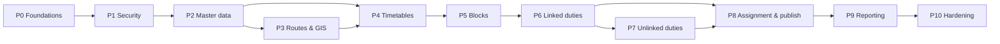

# Implementation Plan — Phase-wise

> Related: [Project statement](Project%20statement.md) · [Architecture](Architecture.md) · [Edge cases](Edge%20case.md) · [Evaluation](Evaluation.md)

This plan builds the system incrementally. Each phase ends with a **working, tested, demonstrable increment** and explicit **exit criteria**. Durations are **indicative** for one to two developers.

---

## 0. Phase overview

| Phase | Name | Indicative duration | Main outcome | Objectives served |
|---|---|---|---|---|
| 0 | Foundations | 1 week | Project skeleton, local PostGIS, CI-ready build, conventions | All |
| 1 | Security & RBAC | 1 week | JWT authentication, roles, depot scope, audit base | O4, O5 |
| 2 | Master data & paging/filtering framework | 2 weeks | Depots, buses, crew, stops with reusable pagination and filters | O1, O4 |
| 3 | Route management & geospatial | 2 weeks | Routes as geometries, overlap detection, coverage, proposal workflow | O3 |
| 4 | Timetables, trips & synthetic data | 1 week | Headway-based trip generation, deadhead matrix, S/M/L datasets | O1 |
| 5 | Vehicle scheduling (blocks) | 1 week | Trips → blocks, bus assignment, run infrastructure | O1, O2 |
| 6 | Constraint engine & linked duties | 2 weeks | Rule sets, relief points, linked duty builder | O1, O2 |
| 7 | Unlinked duties & handovers | 2 weeks | Piece cutting, cross-bus duties, handovers, local search | O1, O2 |
| 8 | Crew assignment, conflicts, overrides, publish | 2 weeks | Rostering, conflict workflow, lifecycle, DB guarantees | O2, O4 |
| 9 | Reporting, dashboard & audit | 1 week | KPIs, real-time snapshot, SSE, audit queries | O4, O5 |
| 10 | Hardening & deployment | 1 week | Performance, security scans, observability, packaging | All |
| | **Total** | **~16 weeks** | | |



### Definition of Done (every phase)

- [ ] Code follows the module and layer boundaries in [Architecture §4](Architecture.md). ArchUnit tests pass.
- [ ] Unit tests for domain logic. Integration tests (Testcontainers PostGIS) for repositories and native SQL.
- [ ] New endpoints appear in OpenAPI with request/response examples and required roles.
- [ ] Authorization tests exist for every new endpoint and role combination.
- [ ] Flyway migration added. The schema starts cleanly from an empty database.
- [ ] Relevant edge cases from [Edge case.md](Edge%20case.md) have tests.
- [ ] Phase exit criteria met and demonstrated.

---

## Phase 0 — Foundations

### Goal
A reproducible project skeleton that builds, runs against a local PostGIS and has test infrastructure ready.

### Tasks
- [ ] Generate a Spring Boot 3.x project (Java 21, Maven) with base package `com.dtc.transit`.
- [ ] Add dependencies (below).
- [ ] `docker-compose.yml` with PostGIS.
- [ ] Profiles: `local`, `test`, `prod`. Externalised configuration through environment variables.
- [ ] Flyway `V1__extensions.sql` (`postgis`, `btree_gist`) and sequences.
- [ ] `common` module: `ProblemDetail` handler, `Clock` bean, correlation ID filter, `ServiceTime` utilities.
- [ ] Testcontainers base class using `postgis/postgis:16-3.4`.
- [ ] ArchUnit test skeleton enforcing module boundaries.
- [ ] springdoc-openapi and Actuator (health, info, prometheus).
- [ ] Formatting and static analysis (Spotless, Error Prone or SpotBugs).

### Project structure

```
dtc-bus-scheduling/
├── pom.xml
├── docker-compose.yml
├── src/main/java/com/dtc/transit/
│   ├── TransitApplication.java
│   ├── common/          config, error, paging, filtering, geo, time, audit base
│   ├── security/        SecurityConfig, TokenService, AuthController, DepotAccessEvaluator
│   ├── user/
│   ├── masterdata/      depot/ bus/ crew/ stop/
│   ├── route/           route/ pattern/ overlap/ coverage/ proposal/
│   ├── timetable/       timetable/ headway/ trip/ deadhead/ calendar/
│   ├── scheduling/
│   │   ├── engine/      model/ vehicle/ relief/ duty/ assignment/ constraint/ search/   (no Spring!)
│   │   ├── rules/       RuleSet entity + binding
│   │   ├── run/         ScheduleRun, RunWorker, RunReaper, SSE
│   │   ├── schedule/    Schedule, Block, Duty, Assignment, Conflict entities + services
│   │   └── api/
│   ├── reporting/
│   └── audit/
├── src/main/resources/
│   ├── application.yml
│   └── db/migration/
└── src/test/java/com/dtc/transit/
    ├── architecture/    ArchUnit rules
    ├── support/         PostgisContainerTest, TestData builders, JwtTestTokens
    └── ...              mirrors main
```

### Key dependencies (`pom.xml` excerpt)

```xml
<properties>
  <java.version>21</java.version>
</properties>

<dependencies>
  <dependency><groupId>org.springframework.boot</groupId><artifactId>spring-boot-starter-web</artifactId></dependency>
  <dependency><groupId>org.springframework.boot</groupId><artifactId>spring-boot-starter-validation</artifactId></dependency>
  <dependency><groupId>org.springframework.boot</groupId><artifactId>spring-boot-starter-data-jpa</artifactId></dependency>
  <dependency><groupId>org.springframework.boot</groupId><artifactId>spring-boot-starter-security</artifactId></dependency>
  <dependency><groupId>org.springframework.boot</groupId><artifactId>spring-boot-starter-oauth2-resource-server</artifactId></dependency>
  <dependency><groupId>org.springframework.boot</groupId><artifactId>spring-boot-starter-actuator</artifactId></dependency>

  <!-- Geospatial: version managed by Spring Boot's Hibernate BOM -->
  <dependency><groupId>org.hibernate.orm</groupId><artifactId>hibernate-spatial</artifactId></dependency>
  <!-- GeoJSON read/write; align version with the jts-core pulled in by hibernate-spatial -->
  <dependency><groupId>org.locationtech.jts.io</groupId><artifactId>jts-io-common</artifactId><version>${jts.version}</version></dependency>

  <dependency><groupId>org.postgresql</groupId><artifactId>postgresql</artifactId><scope>runtime</scope></dependency>
  <dependency><groupId>org.flywaydb</groupId><artifactId>flyway-core</artifactId></dependency>
  <dependency><groupId>org.flywaydb</groupId><artifactId>flyway-database-postgresql</artifactId></dependency>

  <dependency><groupId>org.mapstruct</groupId><artifactId>mapstruct</artifactId><version>${mapstruct.version}</version></dependency>
  <dependency><groupId>org.springdoc</groupId><artifactId>springdoc-openapi-starter-webmvc-ui</artifactId><version>${springdoc.version}</version></dependency>
  <dependency><groupId>com.github.ben-manes.caffeine</groupId><artifactId>caffeine</artifactId></dependency>
  <dependency><groupId>io.micrometer</groupId><artifactId>micrometer-registry-prometheus</artifactId></dependency>

  <!-- Test -->
  <dependency><groupId>org.springframework.boot</groupId><artifactId>spring-boot-starter-test</artifactId><scope>test</scope></dependency>
  <dependency><groupId>org.springframework.security</groupId><artifactId>spring-security-test</artifactId><scope>test</scope></dependency>
  <dependency><groupId>org.springframework.boot</groupId><artifactId>spring-boot-testcontainers</artifactId><scope>test</scope></dependency>
  <dependency><groupId>org.testcontainers</groupId><artifactId>postgresql</artifactId><scope>test</scope></dependency>
  <dependency><groupId>org.testcontainers</groupId><artifactId>junit-jupiter</artifactId><scope>test</scope></dependency>
  <dependency><groupId>net.jqwik</groupId><artifactId>jqwik</artifactId><version>${jqwik.version}</version><scope>test</scope></dependency>
  <dependency><groupId>com.tngtech.archunit</groupId><artifactId>archunit-junit5</artifactId><version>${archunit.version}</version><scope>test</scope></dependency>
</dependencies>
```

> Pin all `${...}` versions to the latest stable releases compatible with the chosen Spring Boot version.

### `docker-compose.yml`

```yaml
services:
  db:
    image: postgis/postgis:16-3.4
    environment:
      POSTGRES_DB: dtc_transit
      POSTGRES_USER: dtc
      POSTGRES_PASSWORD: ${DB_PASSWORD:-local_dev_only}
    ports:
      - "5432:5432"
    volumes:
      - pgdata:/var/lib/postgresql/data
    healthcheck:
      test: ["CMD-SHELL", "pg_isready -U dtc -d dtc_transit"]
      interval: 5s
      retries: 10
volumes:
  pgdata:
```

### `application.yml` (base)

```yaml
spring:
  application:
    name: dtc-transit
  datasource:
    url: ${DB_URL:jdbc:postgresql://localhost:5432/dtc_transit}
    username: ${DB_USER:dtc}
    password: ${DB_PASSWORD:local_dev_only}
    hikari:
      maximum-pool-size: 20
  jpa:
    open-in-view: false
    hibernate:
      ddl-auto: validate
    properties:
      hibernate:
        jdbc.time_zone: UTC
        jdbc.batch_size: 500
        order_inserts: true
        order_updates: true
  data:
    web:
      pageable:
        default-page-size: 20
        max-page-size: 100
  threads:
    virtual:
      enabled: true
  flyway:
    enabled: true

management:
  endpoints:
    web:
      exposure:
        include: health,info,prometheus
  endpoint:
    health:
      probes:
        enabled: true
```

### Test base

```java
@SpringBootTest
@Testcontainers
public abstract class PostgisContainerTest {

    @Container
    @ServiceConnection
    static final PostgreSQLContainer<?> POSTGIS = new PostgreSQLContainer<>(
            DockerImageName.parse("postgis/postgis:16-3.4").asCompatibleSubstituteFor("postgres"));
}
```

### Deliverables
Runnable app, `/actuator/health` returning UP, Swagger UI, an empty migrated schema and a passing test suite.

### Exit criteria
- `./mvnw verify` passes from a clean checkout, including one Testcontainers test.
- The app starts against `docker compose up` and Flyway applies V1.
- The ArchUnit rule "engine has no Spring/JPA imports" exists and passes.

---

## Phase 1 — Security & RBAC

### Goal
Every endpoint is authenticated. Roles and depot scope are enforced. Tokens can be revoked in practice.

### Tasks
- [ ] Migration: `app_user`, `user_role`, `refresh_token`, `audit_log` (partitioned).
- [ ] `UserService`: create, update roles and depot, enable/disable (increments `token_version`).
- [ ] `TokenService`: RS256 `JwtEncoder`/`JwtDecoder` (Nimbus), 15-minute access tokens, 7-day hashed refresh tokens with rotation and reuse detection.
- [ ] `AuthController`: `login`, `refresh`, `logout`.
- [ ] `SecurityConfig`: stateless, deny by default, JWT roles converter, CORS allow-list, security headers.
- [ ] `TokenVersionFilter`: rejects tokens whose `tv` claim is behind the user's current version (cached 60 s).
- [ ] `DepotAccessEvaluator` and a `DepotScope` specification helper.
- [ ] Login rate limiting (Bucket4j) and account lockout.
- [ ] Audit event infrastructure (`AuditEvent`, listener writing in the same transaction).
- [ ] Seed an admin user through an environment-provided bootstrap password (local profile only).

### Key code

```java
@Configuration
@EnableMethodSecurity
class SecurityConfig {

    @Bean
    SecurityFilterChain api(HttpSecurity http, TokenVersionFilter tokenVersionFilter) throws Exception {
        return http
            .csrf(csrf -> csrf.disable())                                   // stateless bearer tokens
            .sessionManagement(s -> s.sessionCreationPolicy(SessionCreationPolicy.STATELESS))
            .authorizeHttpRequests(auth -> auth
                .requestMatchers(HttpMethod.POST, "/api/v1/auth/login", "/api/v1/auth/refresh").permitAll()
                .requestMatchers("/actuator/health/**").permitAll()
                .requestMatchers("/api/v1/users/**").hasRole("ADMIN")
                .requestMatchers(HttpMethod.POST, "/api/v1/schedules/*/publish").hasAnyRole("ADMIN", "MANAGER")
                .requestMatchers(HttpMethod.POST, "/api/v1/routes/*/decision").hasAnyRole("ADMIN", "MANAGER")
                .anyRequest().authenticated())
            .oauth2ResourceServer(o -> o.jwt(jwt -> jwt.jwtAuthenticationConverter(rolesConverter())))
            .addFilterAfter(tokenVersionFilter, BearerTokenAuthenticationFilter.class)
            .build();
    }

    private JwtAuthenticationConverter rolesConverter() {
        var authorities = new JwtGrantedAuthoritiesConverter();
        authorities.setAuthoritiesClaimName("roles");
        authorities.setAuthorityPrefix("ROLE_");
        var converter = new JwtAuthenticationConverter();
        converter.setJwtGrantedAuthoritiesConverter(authorities);
        return converter;
    }
}
```

```java
@Component("depotAccess")
public class DepotAccessEvaluator {

    /** HQ users (no depot claim) can access every depot; depot-bound users only their own. */
    public boolean canAccess(Long depotId) {
        var jwt = (Jwt) SecurityContextHolder.getContext().getAuthentication().getPrincipal();
        Long userDepot = jwt.getClaim("depot");
        return userDepot == null || userDepot.equals(depotId);
    }
}
```

```java
// Usage on an application service
@PreAuthorize("hasAnyRole('ADMIN','MANAGER','SCHEDULER') and @depotAccess.canAccess(#cmd.depotId())")
public ScheduleRunId startRun(StartRunCommand cmd) { ... }
```

### Tests
- Login success and failure, lockout after 5 failures, refresh rotation, refresh reuse revoking the token family.
- A disabled user's token is rejected after the cache TTL.
- A parameterised test over the permission matrix, which grows in each later phase.

### Exit criteria
- Unauthenticated calls to any non-public endpoint return 401. Wrong role returns 403. Out-of-depot access returns 404.
- JWTs are signed with RS256. `alg=none` and HS256 tokens are rejected (tested).
- Login and user administration are audited.

---

## Phase 2 — Master data & pagination/filtering framework

### Goal
CRUD for depots, buses, crew and stops, with a **reusable pagination, filtering and sorting framework** that every later list endpoint uses.

### Tasks
- [ ] Migrations: `depot`, `bus`, `bus_unavailability`, `crew_member`, `crew_depot_history`, `crew_leave`, `crew_qualification`, `stop` (GiST indexes).
- [ ] Entities with `@Version`, sequence IDs (`allocationSize = 50`) and JTS `Point` columns.
- [ ] `common.paging`: `PageResponse`, `SortWhitelist`, `includeTotal` → `Slice`, `CursorPage` for keyset.
- [ ] `common.filtering`: filter records bound from query parameters, a `Specifications` helper, and range and enum validation.
- [ ] `common.geo`: `GeoJsonCodec`, `bbox`/`near` parameter parsing and validation (service-area check, lon/lat order).
- [ ] Normalisation: registration numbers (upper case, no spaces or dashes), employee codes kept as text (leading zeros preserved).
- [ ] Endpoints #7–#17 from the [catalogue](Architecture.md).
- [ ] CSV bulk import for buses and crew: per-row validation report, all-or-nothing per file (`dryRun=true` supported).
- [ ] Depot scope applied to all list and detail queries.

### Key code

```java
public record PageResponse<T>(List<T> content, int page, int size,
                              Long totalElements, Integer totalPages, boolean hasNext, List<String> sort) {

    public static <E, T> PageResponse<T> of(Page<E> p, Function<E, T> mapper) {
        return new PageResponse<>(p.map(mapper).getContent(), p.getNumber(), p.getSize(),
                p.getTotalElements(), p.getTotalPages(), p.hasNext(), sortOf(p.getSort()));
    }

    public static <E, T> PageResponse<T> of(Slice<E> s, Function<E, T> mapper) {   // includeTotal=false
        return new PageResponse<>(s.map(mapper).getContent(), s.getNumber(), s.getSize(),
                null, null, s.hasNext(), sortOf(s.getSort()));
    }

    private static List<String> sortOf(Sort sort) {
        return sort.stream().map(o -> o.getProperty() + "," + o.getDirection().name().toLowerCase()).toList();
    }
}
```

```java
@Component
public class SortWhitelist {

    /** Rejects unknown sort fields and always appends id for a stable order. */
    public Pageable check(Pageable pageable, Set<String> allowed) {
        for (Sort.Order o : pageable.getSort()) {
            if (!allowed.contains(o.getProperty())) {
                throw new InvalidSortException(o.getProperty(), allowed);
            }
        }
        Sort stable = pageable.getSort().and(Sort.by("id"));
        return PageRequest.of(pageable.getPageNumber(), pageable.getPageSize(), stable);
    }
}
```

```java
public record BusFilter(Long depotId, BusStatus status, FuelType fuelType, BusType busType, Boolean ac, String q) {}

final class BusSpecifications {
    static Specification<Bus> of(BusFilter f, DepotScope scope) {
        return Specification.allOf(
            scope.restrict("depot"),
            eq("depot.id", f.depotId()),
            eq("status", f.status()),
            eq("fuelType", f.fuelType()),
            eq("busType", f.busType()),
            eq("ac", f.ac()),
            f.q() == null ? null : (root, query, cb) -> cb.or(
                cb.like(root.get("registrationNo"), "%" + RegistrationNo.normalise(f.q()) + "%"),
                cb.like(cb.upper(root.get("fleetNo")), "%" + f.q().toUpperCase() + "%")));
    }
}
```

```java
@RestController
@RequestMapping("/api/v1/buses")
class BusController {

    private static final Set<String> SORTABLE = Set.of("fleetNo", "registrationNo", "status", "depot.code");

    @GetMapping
    PageResponse<BusDto> list(BusFilter filter, @PageableDefault(sort = "fleetNo") Pageable pageable,
                              @RequestParam(defaultValue = "true") boolean includeTotal) {
        return busService.search(filter, sortWhitelist.check(pageable, SORTABLE), includeTotal);
    }
}
```

> Wildcards in `q` (`%` and `_`) are escaped before building the `LIKE` pattern. Filter values are always bound parameters, never concatenated into SQL.

### Tests
- Pagination edge cases: size over 100 clamped, negative page gives 400, page beyond end gives empty result, unknown sort gives 400, stable order with duplicate sort values.
- Depot-scoped scheduler cannot list or fetch another depot's buses (404).
- CSV import: duplicate registration in different formats, leading-zero employee codes, UTF-8 Hindi names, unknown depot code.

### Exit criteria
- Endpoints #7–#17 are implemented, documented and authorization-tested.
- Paging and filtering framework reused by at least 4 list endpoints.
- `EXPLAIN ANALYZE` shows index usage for filtered list queries on 100k synthetic rows.

---

## Phase 3 — Route management & geospatial

### Goal
Routes stored as validated geometries, fast overlap detection between existing and proposed routes, coverage analysis and a proposal workflow.

### Tasks
- [ ] Migrations: `route`, `route_pattern` (generated `geom_utm`, `length_m`, GiST), `pattern_stop`, `running_time_band`, `route_overlap`, `coverage_zone`, `grid_cell`, `service_area`, materialized view `cell_coverage`.
- [ ] `RoutePattern` entity with a JTS `LineString`. Hibernate Spatial mapping.
- [ ] Geometry validation pipeline: parse GeoJSON → check SRID/CRS → check lon/lat order via the service area → ≥ 2 distinct points → `ST_IsValid` → optional `ST_SimplifyPreserveTopology` → vertex cap (e.g. 5,000).
- [ ] Stop-to-line distance check (warn if > 50 m). Compute `dist_from_start_m` with `ST_LineLocatePoint`.
- [ ] `OverlapAnalysisService` using the native query from [Architecture §7.2](Architecture.md): shared stops, direction agreement, severity.
- [ ] `CoverageService`: grid-cell coverage view refresh, zone coverage query, proposal coverage gain.
- [ ] Proposal state machine with guarded transitions (`submit` stores analysis, `decision` requires MANAGER and a reason).
- [ ] Spatial filters: `bbox`, `passesNear` on `/routes`, `/stops`.
- [ ] Endpoints #18–#26.
- [ ] Recompute overlaps asynchronously when an ACTIVE pattern changes.

### Key code

```java
@Entity
@Table(name = "route_pattern")
public class RoutePattern {

    @Id
    @GeneratedValue(strategy = GenerationType.SEQUENCE, generator = "route_pattern_seq")
    @SequenceGenerator(name = "route_pattern_seq", sequenceName = "route_pattern_seq", allocationSize = 50)
    private Long id;

    @ManyToOne(fetch = FetchType.LAZY, optional = false)
    private Route route;

    @Enumerated(EnumType.STRING)
    private Direction direction;

    @Column(columnDefinition = "geometry(LineString,4326)", nullable = false)
    private LineString geom;

    @Column(name = "length_m", insertable = false, updatable = false)
    private Double lengthM;                       // generated in DB

    @Version
    private long version;
}
```

```java
public interface OverlapRow {
    Long getPatternId();
    String getRouteNo();
    String getDirection();
    double getOverlapM();
    double getOverlapRatio();
}

public interface RoutePatternRepository extends JpaRepository<RoutePattern, Long> {

    @Query(nativeQuery = true, value = """
        WITH proposed AS (
          SELECT ST_Transform(ST_SetSRID(ST_GeomFromGeoJSON(:geojson), 4326), 32643) AS g
        ),
        candidates AS (
          SELECT rp.id, rp.route_id, rp.direction, rp.geom_utm
          FROM route_pattern rp, proposed p
          WHERE ST_DWithin(rp.geom_utm, p.g, :bufferM)
            AND rp.id <> COALESCE(:excludeId, -1)
        ),
        segments AS (
          SELECT c.id AS pattern_id, c.route_id, c.direction, d.geom AS seg
          FROM candidates c, proposed p,
               LATERAL ST_Dump(ST_Intersection(p.g,
                   ST_Buffer(c.geom_utm, :bufferM, 'endcap=flat join=round'))) d
        )
        SELECT s.pattern_id AS patternId, r.route_no AS routeNo, s.direction AS direction,
               SUM(ST_Length(s.seg)) AS overlapM,
               SUM(ST_Length(s.seg)) / (SELECT ST_Length(g) FROM proposed) AS overlapRatio
        FROM segments s
        JOIN route r ON r.id = s.route_id AND r.status = 'ACTIVE'
        WHERE ST_Length(s.seg) >= :minSegmentM
        GROUP BY s.pattern_id, r.route_no, s.direction
        ORDER BY overlapM DESC
        """)
    List<OverlapRow> findOverlaps(@Param("geojson") String geojson,
                                  @Param("bufferM") double bufferM,
                                  @Param("minSegmentM") double minSegmentM,
                                  @Param("excludeId") Long excludeId);
}
```

```java
// Simple spatial filter via Hibernate Spatial HQL function
@Query("select s from Stop s where s.active = true and st_within(s.location, :bbox) = true")
Page<Stop> findInBbox(@Param("bbox") Polygon bbox, Pageable pageable);
```

### Tests (Testcontainers + hand-built geometries)
- **Identical routes:** ratio ≈ 1.0. **Parallel road 40 m away:** 0 at a 25 m buffer. **Crossing routes:** 0 (segment < 200 m). **Partial shared corridor of 3 km on a 10 km route:** ratio ≈ 0.30 ± 0.01.
- Opposite direction on the same corridor is detected and labelled `same_direction = false`.
- Loop route (start = end) and out-and-back route lengths are not double counted.
- Swapped lon/lat input is rejected with a helpful message. An invalid geometry is rejected.
- Coverage: a zone fully within 500 m of a stop gives 1.0. A zone with no stops gives 0.
- Performance: an overlap query against 2,000 patterns completes in under 500 ms (p95) with GiST, and is compared with the same query without the index.

### Exit criteria
- The overlap analysis reproduces expected values on a labelled fixture set (see [Evaluation §8](Evaluation.md)).
- The proposal workflow is enforced, audited and authorization-tested.
- Endpoints #18–#26 are documented with GeoJSON examples.

---

## Phase 4 — Timetables, trips & synthetic data

### Goal
Generate trips from headways, maintain deadhead times and produce reproducible datasets for scheduling development and evaluation.

### Tasks
- [ ] Migrations: `timetable`, `headway_band`, `trip`, `deadhead`, `calendar_exception`.
- [ ] `TripGenerator`: per direction, walk the headway bands from service start to end and look up running time by departure band. Trips overlapping band boundaries use the band at departure.
- [ ] Validation: bands must not overlap, `end > start`, plausible average speed (e.g. 8–45 km/h in urban operation), no duplicate trips.
- [ ] `DeadheadMatrix`: measured values or an estimate (straight-line × detour factor 1.3 ÷ band speed) flagged `estimated = true`.
- [ ] Day-type resolution with calendar exceptions (holidays, special events).
- [ ] Timetable change marks dependent drafts and published schedules `needs_revalidation`.
- [ ] **Synthetic data generator** (`seed` profile, CLI runner) with a fixed random seed:
  - **S:** 1 depot, 20 routes, ~120 buses, ~1,200 trips, ~300 crew
  - **M:** 10 depots, ~1,200 buses, ~12,000 trips, ~3,000 crew
  - **L:** 45 depots, **5,000+ buses**, ~50,000 trips, ~12,000 crew
  - Realistic structure: morning and evening peaks, radial and ring routes, terminals as relief points, EV share, leave rate and licence-expiry distribution.
- [ ] Optional GTFS static importer (stops, routes, shapes, trips) to seed realistic geometry and trips, subject to the data source's licence terms.
- [ ] Endpoints #27–#29 (trips list uses keyset pagination).

### Key code

```java
public List<TripDraft> generate(Timetable tt, RoutePattern pattern, Direction dir) {
    var trips = new ArrayList<TripDraft>();
    for (HeadwayBand band : tt.bands(dir)) {                          // sorted, non-overlapping
        for (int dep = band.fromSec(); dep < band.toSec(); dep += band.headwaySec()) {
            int run = pattern.runningTimeAt(tt.dayType(), dep);          // band lookup by departure time
            trips.add(new TripDraft(pattern.id(), dep, dep + run, pattern.lengthM()));
        }
    }
    return trips;
}
```

### Exit criteria
- Generated trip counts match the analytical count Σ ⌈band length / headway⌉ per band.
- S, M and L datasets are generated deterministically from the same seed (checksum stable).
- Holiday override changes the timetable picked for that date (tested).

---

## Phase 5 — Vehicle scheduling (blocks) & run infrastructure

### Goal
Turn a depot-day's trips into blocks, assign buses, and run it all through the asynchronous job pipeline.

### Tasks
- [ ] Engine model (pure Java records): `TripView`, `DepotContext`, `VehicleClass`, `Block`, `BlockEvent`, `VehicleSchedule`.
- [ ] `GreedyBestFitBlockBuilder` with minimum layover, deadhead, vehicle class, EV range with reserve, midday depot return and charging events.
- [ ] `MinFleetMatchingBlockBuilder` (Hopcroft–Karp) used as an optional builder and as a PVR lower bound.
- [ ] `BusAssigner`: map blocks to physical buses of the class, honouring `bus_unavailability`, preferring an even distribution of km.
- [ ] Migrations: `rule_set` (basic), `schedule_run`, `schedule`, `vehicle_block`, `block_event`, `bus_assignment` (exclusion constraint), `conflict`, plus the partial unique indexes.
- [ ] `ScheduleSnapshotLoader` (read-only, `REPEATABLE READ`) and `SchedulePersister` (JDBC batch).
- [ ] Run queue: `ScheduleRunService.create` (idempotency key), `RunWorker` (claims with `SKIP LOCKED`), heartbeat, `RunReaper`.
- [ ] Endpoints #32, #33, #35, #36.

### Key code

```java
public final class GreedyBestFitBlockBuilder implements BlockBuilder {

    @Override
    public VehicleSchedule build(List<TripView> trips, DepotContext ctx, RuleSet rules) {
        List<TripView> ordered = trips.stream()
                .sorted(Comparator.comparingInt(TripView::startSec).thenComparingLong(TripView::id))
                .toList();

        List<BlockDraft> blocks = new ArrayList<>();
        List<Uncovered> uncovered = new ArrayList<>();

        for (TripView trip : ordered) {
            BlockDraft best = null;
            int bestSlack = Integer.MAX_VALUE;

            for (BlockDraft b : blocks) {
                if (!b.vehicleClass().satisfies(trip.requiredClass())) continue;
                int readyAt = b.endSec()
                        + rules.minLayoverSec(b.lastTrip())
                        + ctx.deadheadSec(b.endStopId(), trip.startStopId(), b.endSec());
                int slack = trip.startSec() - readyAt;
                if (slack >= 0 && slack < bestSlack && b.canAppend(trip, ctx, rules)) {   // EV range, max block length
                    best = b;
                    bestSlack = slack;
                }
            }

            if (best != null) {
                best.append(trip, ctx, rules);             // inserts DEPOT_PARK / CHARGING if slack is large
            } else if (ctx.fleet().hasCapacity(trip.requiredClass(), blocks)) {
                blocks.add(BlockDraft.pullOutFor(trip, ctx, rules));
            } else {
                uncovered.add(new Uncovered(trip, ConflictType.UNCOVERED_TRIP,
                        "No available vehicle of class " + trip.requiredClass()));
            }
        }
        return VehicleSchedule.of(blocks.stream().map(b -> b.close(ctx, rules)).toList(), uncovered);
    }
}
```

```java
// Claim a queued run in any app instance, without double processing
@Query(nativeQuery = true, value = """
    UPDATE schedule_run SET status = 'RUNNING', claimed_by = :worker, heartbeat_at = now(), started_at = now()
    WHERE id = (
        SELECT id FROM schedule_run
        WHERE status = 'QUEUED'
        ORDER BY created_at
        FOR UPDATE SKIP LOCKED
        LIMIT 1)
    RETURNING id
    """)
Optional<UUID> claimNext(@Param("worker") String workerId);
```

### Tests
- **Property-based (jqwik):** for any generated trip set, every trip appears in exactly one block or in `uncovered`. Within a block, consecutive trips satisfy layover + deadhead. EV blocks never exceed usable range.
- Greedy PVR is compared with the matching lower bound on the S dataset, and the gap is recorded.
- A second run for the same depot and date while one is QUEUED or RUNNING returns 409.
- Killing a worker mid-run leads the reaper to mark it FAILED, and no partial schedule rows remain.

### Exit criteria
- The S dataset produces blocks with 100 % trip coverage (or explained uncovered trips) in under 5 s.
- The async run lifecycle works end-to-end through the API.

---

## Phase 6 — Constraint engine & linked duties

### Goal
A configurable constraint engine and a linked duty builder that produces legal duties in which the crew stays with one bus.

### Tasks
- [ ] Typed `RuleSet` record with Bean Validation, stored as JSONB, resolved by effective date and depot. Endpoints #30–#31.
- [ ] `Constraint<T>` interface and catalogue: `MaxWorkPerDuty`, `MaxContinuousWork`, `MinBreak`, `MaxSpreadOver`, `MinPaidDuty` (soft) and others.
- [ ] Incremental evaluation API (`DutyAccumulator`) for fast feasibility checks during construction.
- [ ] `ReliefOpportunityFinder`.
- [ ] `LinkedDutyBuilder` (algorithm in [Architecture §6.4](Architecture.md)), including split linked duties around midday depot parking.
- [ ] Duty metrics: sign-on/off, platform, paid, breaks, spread-over, overtime. Duty type classification.
- [ ] Handover records at cut points.
- [ ] Migrations: `piece_of_work`, `duty`, `duty_piece`, `handover`.
- [ ] Endpoints #37, #38, #40.

### Key code

```java
public interface Constraint<T> {
    String code();
    Severity severity();
    List<Violation> check(T subject, ValidationContext ctx);
}

public final class MaxContinuousWork implements Constraint<DutyView> {

    @Override public String code()         { return "CONTINUOUS_WORK_EXCEEDED"; }
    @Override public Severity severity()   { return Severity.HARD; }

    @Override
    public List<Violation> check(DutyView duty, ValidationContext ctx) {
        int limit = ctx.rules().maxContinuousWorkMin() * 60;
        int minBreak = ctx.rules().minBreakMin() * 60;
        int continuous = 0;
        for (DutySegment seg : duty.segments()) {                // WORK and GAP segments in time order
            if (seg.isWork()) {
                continuous += seg.durationSec();
                if (continuous > limit) {
                    return List.of(Violation.hard(code(), duty.ref(),
                            "Continuous work %d min exceeds %d min without a %d-min break at %s"
                                    .formatted(continuous / 60, limit / 60, minBreak / 60, seg.startLabel())));
                }
            } else if (seg.durationSec() >= minBreak) {
                continuous = 0;                                  // only a qualifying break resets the counter
            }
        }
        return List.of();
    }
}
```

```java
public final class LinkedDutyBuilder implements DutyBuilder {

    @Override
    public CrewSchedule build(VehicleSchedule vs, DepotContext ctx, RuleSet rules) {
        var duties = new ArrayList<DutyDraft>();
        var violations = new ArrayList<Violation>();

        for (Block block : vs.blocks()) {
            List<ReliefOpportunity> reliefs = reliefFinder.find(block, ctx, rules);
            int cursor = 0;
            while (cursor < reliefs.size() - 1) {
                OptionalInt cut = bestCut(block, reliefs, cursor, rules);
                if (cut.isEmpty()) {
                    int next = cursor + 1;
                    DutyDraft infeasible = DutyDraft.linked(block, reliefs.get(cursor), reliefs.get(next), rules);
                    duties.add(infeasible);
                    violations.add(Violation.hard("NO_FEASIBLE_RELIEF", infeasible.ref(),
                            "No legal relief between " + reliefs.get(cursor).label() + " and " + reliefs.get(next).label()));
                    cursor = next;
                } else {
                    duties.add(DutyDraft.linked(block, reliefs.get(cursor), reliefs.get(cut.getAsInt()), rules));
                    cursor = cut.getAsInt();
                }
            }
        }
        return CrewSchedule.of(duties, handoversFrom(duties), violations);
    }

    /** Checks every later relief (constraints are not monotone) and picks the cut closest to target work,
        penalising a remainder shorter than the minimum paid duty. */
    private OptionalInt bestCut(Block block, List<ReliefOpportunity> reliefs, int from, RuleSet rules) { ... }
}
```

### Tests
- Unit tests per constraint, including boundaries (exactly at the limit passes, one second over fails).
- A 17-hour block produces 2–3 duties, each legal, with handovers at relief points.
- A block with a 6-hour stretch and no relief point produces a `NO_FEASIBLE_RELIEF` conflict and is not silently accepted.
- Changing `maxContinuousWorkMin` in the rule set changes the output without a code change.

### Exit criteria
- The S dataset in linked mode produces duties with 0 hard violations (except explained `NO_FEASIBLE_RELIEF` conflicts).
- Duty metrics are verified against hand-computed fixtures.

---

## Phase 7 — Unlinked duties & handovers

### Goal
Combine pieces of work across buses into efficient legal duties with feasible handovers, then improve them with local search.

### Tasks
- [ ] `PieceCutter`: dynamic programming per block over relief opportunities, with piece length in `[minPiece, maxContinuousWork]`.
- [ ] Relief-point transfer times (walking or staff shuttle) between relief points, with depot sign-on and sign-off travel.
- [ ] `UnlinkedDutyBuilder` greedy construction ([Architecture §6.5](Architecture.md)).
- [ ] Handover feasibility constraint (`HANDOVER_INFEASIBLE`), max pieces and max bus changeovers (soft).
- [ ] `LocalSearchImprover`: moves `MovePiece`, `SwapPieces`, `MergeDuties`, `SplitDuty`, `ReCut`. Seeded RNG, time budget, cost function from rule-set weights.
- [ ] Determinism: stable ordering, seed persisted on the run, output hash included in run metrics.
- [ ] Run progress events (phase, iteration, best cost) for SSE (#34).

### Key code

```java
public final class LocalSearchImprover {

    public CrewSchedule improve(CrewSchedule start, SearchContext ctx) {
        var rng = new SplittableRandom(ctx.seed());
        var current = start.mutableCopy();
        double currentCost = ctx.cost().of(current);
        int sinceImprovement = 0;
        long deadline = ctx.clock().millis() + ctx.timeBudgetMs();

        while (ctx.clock().millis() < deadline && sinceImprovement < ctx.maxNonImproving()) {
            Move move = ctx.moves().pick(rng).propose(current, rng);
            if (move == null || !move.isHardFeasible(current, ctx.constraints())) {
                sinceImprovement++;
                continue;
            }
            double delta = move.costDelta(current, ctx.cost());       // incremental, touches only affected duties
            if (delta < 0) {
                move.apply(current);
                currentCost += delta;
                sinceImprovement = 0;
                ctx.progress().report(currentCost);
            } else {
                sinceImprovement++;
            }
        }
        return current.freeze();
    }
}
```

### Tests
- **Property-based:** every piece belongs to exactly one duty. Every duty passes all hard constraints. Each handover gap ≥ transfer + buffer. The union of pieces equals the union of block work (nothing lost or duplicated).
- **Determinism:** same input and seed give an identical output hash across 10 runs.
- **Comparison:** on the S and M datasets, unlinked mode needs fewer duties and less paid idle time than linked mode (numbers recorded in the evaluation report).
- Local search never increases cost and never introduces a hard violation.

### Exit criteria
- The M dataset in unlinked mode completes per depot in under 60 s, including a 30 s search budget.
- Handovers are listed through endpoint #38 with relief point and times.

---

## Phase 8 — Crew assignment, conflicts, overrides & publish

### Goal
Assign duties to named crew legally and fairly, explain what cannot be staffed, allow safe manual overrides and publish atomically.

### Tasks
- [ ] Migration: `duty_assignment` with the exclusion constraint on published rows.
- [ ] `CrewHistoryLoader`: rolling 7-day actual and planned assignments (plus 28 days for fairness).
- [ ] `EligibilityFilter` with reason codes. `FairnessScorer`. `MrvCrewAssigner`. Standby pool.
- [ ] Conflict persistence with aggregated rejection reasons.
- [ ] `ValidationService`: full re-check of the whole schedule, producing VALIDATED only with 0 HARD conflicts.
- [ ] Manual override (`PATCH /duty-assignments/{id}` with `If-Match`): re-validate the affected crew's window, reject HARD violations, allow a SOFT override only for MANAGER or ADMIN with a reason, and audit it.
- [ ] `PublishService`: idempotent, one transaction (supersede old → publish new → flip `schedule_status` on assignments), relying on the DB constraints as a final guard.
- [ ] `RevalidationJob`: when a bus goes to maintenance or breakdown, leave is approved or a licence expires, re-check future published schedules and set `needs_revalidation`.
- [ ] Endpoints #15, #39, #41, #42.

### Key code

```java
public final class MrvCrewAssigner implements CrewAssigner {

    @Override
    public Roster assign(CrewSchedule cs, CrewPool pool, CrewHistory history, RuleSet rules) {
        var ctx = new AssignmentContext(pool, history, rules);
        var slots = new ArrayList<>(cs.duties().stream()
                .flatMap(d -> d.requiredRoles().stream().map(role -> new Slot(d, role)))
                .toList());

        int booked = 0;
        while (!slots.isEmpty()) {
            if (booked % 50 == 0) {                                   // refresh MRV ordering periodically
                slots.sort(Comparator.comparingInt(ctx::eligibleCount)
                        .thenComparingInt(s -> s.duty().signOnSec())
                        .thenComparing(s -> s.duty().ref()));
            }
            Slot slot = slots.removeFirst();
            Eligibility e = ctx.evaluate(slot);                        // candidates + rejection reason histogram
            e.candidates().stream()
                    .min(Comparator.comparingDouble((CrewMember c) -> fairness.score(c, slot, ctx))
                            .thenComparing(CrewMember::employeeCode))
                    .ifPresentOrElse(
                            crew -> ctx.book(crew, slot),
                            () -> ctx.unassigned(slot, e.rejectionHistogram()));
            booked++;
        }
        return ctx.toRoster();
    }
}
```

```java
@Transactional
@PreAuthorize("hasAnyRole('ADMIN','MANAGER')")
public PublishResult publish(long scheduleId, String idempotencyKey) {
    Schedule s = schedules.lockById(scheduleId);                        // SELECT ... FOR UPDATE
    if (s.isPublished()) return PublishResult.alreadyPublished(s);      // idempotent
    if (!depotAccess.canAccess(s.depotId())) throw new NotFoundException();
    if (conflicts.countOpenHard(scheduleId) > 0) throw new PublishBlockedException(scheduleId);

    schedules.findPublished(s.depotId(), s.serviceDate()).ifPresent(old -> {
        assignments.setScheduleStatus(old.id(), "SUPERSEDED");
        old.supersede();
    });
    assignments.setScheduleStatus(s.id(), "PUBLISHED");                 // exclusion constraints fire here
    s.publish(currentUser(), clock.instant());
    events.publish(new SchedulePublished(s.id()));                     // audit + dashboard refresh
    return PublishResult.published(s);
}
```

An `ExclusionViolation` raised by PostgreSQL (SQLSTATE `23P01`) is translated to `409 Conflict` with the conflicting crew or bus and its time range.

### Tests
- An eligibility table test per reason code.
- Rest across midnight: a duty ending at 01:30 followed by a duty starting at 09:00 the same calendar day violates a 10 h minimum rest.
- Weekly limits with history from the previous week.
- Two schedulers overriding the same assignment concurrently: one succeeds, the other gets 412/409.
- Publishing with open HARD conflicts returns 422. Publishing twice with the same key returns the same result.
- Forcing an overlapping published assignment via SQL is rejected by the exclusion constraint (proves the guard exists).
- Revalidation: marking a bus as broken down creates a `BUS_UNAVAILABLE` conflict on the published schedule.

### Exit criteria
- The L dataset (5,000+ buses) is scheduled across all depots with published schedules containing 0 HARD violations.
- Every unassigned duty has a reason histogram.
- The override and publish flows are fully audited.

---

## Phase 9 — Reporting, dashboard & audit

### Goal
Managers and schedulers get timely KPIs and an operations snapshot. Auditors get a queryable trail.

### Tasks
- [ ] Materialized views: `mv_fleet_utilization_daily`, `mv_crew_hours_weekly`, `mv_schedule_kpis`. Refreshed on publish (debounced) and nightly.
- [ ] Report endpoints #43–#46 with filters, pagination and CSV export (`Accept: text/csv`, streamed).
- [ ] `/dashboard/today` (#47): buses out now, blocks unassigned, duties unassigned, open conflicts by type, buses unavailable. Reads live tables with a 30 s cache.
- [ ] SSE for run progress (#34) and optional dashboard push on publish or conflict events.
- [ ] Audit log endpoint #48 with keyset pagination and filters (actor, entity, action, time range).
- [ ] PII masking by role in crew responses (phone, address, licence number partially masked for non-managers).

### Key SQL

```sql
CREATE MATERIALIZED VIEW mv_fleet_utilization_daily AS
SELECT s.depot_id,
       s.service_date,
       COUNT(DISTINCT vb.id)                                          AS blocks,
       SUM(vb.service_km)                                             AS service_km,
       SUM(vb.dead_km)                                                AS dead_km,
       SUM(vb.dead_km) / NULLIF(SUM(vb.service_km + vb.dead_km), 0)   AS dead_km_ratio,
       SUM(e.trip_sec)::numeric / NULLIF(SUM(vb.pull_in_sec - vb.pull_out_sec), 0) AS in_service_ratio
FROM schedule s
JOIN vehicle_block vb ON vb.schedule_id = s.id
JOIN LATERAL (
     SELECT COALESCE(SUM(be.end_sec - be.start_sec), 0) AS trip_sec
     FROM block_event be WHERE be.block_id = vb.id AND be.type = 'TRIP') e ON true
WHERE s.status = 'PUBLISHED'
GROUP BY s.depot_id, s.service_date;

CREATE UNIQUE INDEX ON mv_fleet_utilization_daily (depot_id, service_date);  -- enables REFRESH CONCURRENTLY
```

PVR (peak concurrent blocks) is computed in Java from block intervals with a sweep line, or with `generate_series` over 5-minute buckets.

### Exit criteria
- Report figures match an independent computation from raw tables on the S dataset (tested).
- Reports only include PUBLISHED schedules (superseded ones are excluded).
- Audit completeness test: every write endpoint produces exactly one audit record.

---

## Phase 10 — Hardening & deployment

### Goal
Production-ready performance, security, observability and packaging.

### Tasks
**Performance**
- [ ] k6 or Gatling load tests with the scenario mix from [Evaluation §9](Evaluation.md).
- [ ] `EXPLAIN (ANALYZE, BUFFERS)` review of the top 20 queries. Add or adjust indexes. Check for N+1 with Hibernate statistics.
- [ ] HikariCP pool sizing and a bounded engine executor size.
- [ ] Full-fleet scheduling benchmark (L dataset) with parallel depot runs.

**Security**
- [ ] OWASP Dependency-Check or equivalent in the build. OWASP ZAP API scan against the OpenAPI spec.
- [ ] Verify security headers, CORS and actuator exposure. Scan for secrets.
- [ ] Least-privilege DB roles: `app_rw` (DML only), `migrator` (DDL), and UPDATE/DELETE revoked on `audit_log`.

**Observability**
- [ ] Custom metrics: `scheduling.run.duration{mode}`, `scheduling.run.failures`, `scheduling.conflicts{type}`, `route.overlap.duration`, `api.page.size`.
- [ ] Grafana dashboard plus alerts (run failures, p95 latency, DB pool saturation, stuck runs).
- [ ] JSON logs with `traceId`, `userId`, `depotId`.

**Packaging and operations**
- [ ] Multi-stage Dockerfile (layered jar, non-root user, JRE 21).
- [ ] Production compose or Kubernetes manifests with liveness and readiness probes and resource limits.
- [ ] Backup and restore procedure (base backup + WAL). Restore rehearsal.
- [ ] Runbook: stuck run, publish blocked, revalidation storm, key rotation, restore.

### Dockerfile

```dockerfile
FROM eclipse-temurin:21-jdk AS build
WORKDIR /app
COPY . .
RUN ./mvnw -q -DskipTests package && java -Djarmode=layertools -jar target/*.jar extract

FROM eclipse-temurin:21-jre
RUN useradd --system --uid 1001 app
WORKDIR /app
COPY --from=build /app/dependencies/ ./
COPY --from=build /app/spring-boot-loader/ ./
COPY --from=build /app/snapshot-dependencies/ ./
COPY --from=build /app/application/ ./
USER app
EXPOSE 8080
ENTRYPOINT ["java", "-XX:MaxRAMPercentage=75", "org.springframework.boot.loader.launch.JarLauncher"]
```

> Newer Spring Boot versions replace `layertools` with `-Djarmode=tools extract --layers`. Use the form that matches the pinned Boot version.

### Exit criteria
- All performance targets in [Evaluation](Evaluation.md) are met, or deviations are documented with root cause.
- No high or critical findings from dependency and ZAP scans.
- A clean deployment from the image to a fresh environment with a restored database backup succeeds.

---

## Risk register

| Risk | Impact | Likelihood | Mitigation |
|---|---|---|---|
| Labour-rule values differ from assumptions | Illegal or over-conservative schedules | High | Rules are data (rule sets), reviewed with DTC HR/legal before go-live |
| Real data quality (geometry, spreadsheets) is poor | Wrong overlaps, import failures | High | Validation pipeline, dry-run imports, data-quality report, estimated-deadhead flags |
| Heuristic quality insufficient | More duties or buses than necessary | Medium | Lower bounds to measure the gap, local search, pluggable solver interface |
| Full-fleet run time too long | Missed planning windows | Medium | Depot partitioning, parallel workers, time-bounded search |
| Scope creep into real-time operations (AVL) | Delays | Medium | Explicitly out of scope for v1 |
| Spatial query performance at scale | Slow analysis | Low–Medium | Generated projected columns, GiST, grid-based coverage, materialized views |
| Concurrency bugs in publish or override | Double booking | Low | DB exclusion constraints, optimistic locking, concurrency tests |
