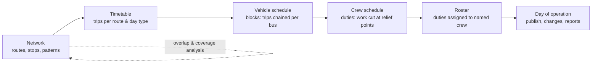

# Project Statement — Automated Bus Scheduling & Route Management System (DTC)

> **Purpose of this document:** the single source of truth for *why* this system exists, *what* problem it solves, *who* it serves and *what* it must do. Every other document traces back to the requirements defined here:
> [Architecture](Architecture.md) · [Implementation](Implementation.md) · [Edge cases](Edge%20case.md) · [Evaluation](Evaluation.md)

> **Note on figures:** numbers marked *(assumption)* are planning assumptions used for sizing and design. They must be validated against real DTC data, standing orders and applicable labour rules before production use.

---

## 1. Summary

Delhi Transport Corporation (DTC) runs one of India's largest city bus operations. Deciding **which bus runs which trips**, **which crew operates which bus**, **when crews hand over and rest**, and **whether a proposed route duplicates an existing one** is still largely done by hand, using spreadsheets, paper registers and the experience of depot staff.

This project builds a **Spring Boot backend** that:

1. **Automates linked and unlinked duty scheduling** for a fleet of **5,000+ buses** through RESTful APIs, replacing manual spreadsheet workflows.
2. **Models crew–bus assignments, shift handovers and mandatory rest-period constraints** in scheduling algorithms, reducing scheduling conflicts and improving resource utilization.
3. **Manages routes geospatially** with **PostGIS** and **Hibernate Spatial**, detecting overlap between existing and proposed routes and measuring service coverage.
4. **Enforces role-based access control** with **Spring Security**, and offers **pagination and filtering across 15+ API endpoints** for schedulers, planners and managers, backed by real-time data and reporting.

**Tech stack:** Java, Spring Boot, Spring Security, PostgreSQL, PostGIS, Hibernate Spatial.

---

## 2. Background

### 2.1 The organisation

- DTC is the state-owned public bus operator for the National Capital Territory of Delhi.
- The operation is **depot-based**. Buses and crew (drivers and conductors) belong to a depot. Each day, buses pull out of the depot, run trips on assigned routes and pull back in.
- The fleet is **mixed**: CNG buses and a growing share of **electric buses**, in standard, low-floor, AC and non-AC variants. Electric buses add range and charging constraints.
- The scope of this project is **5,000+ buses**. Sizing assumptions: **~40–50 depots**, **~10,000+ crew members** and **~50,000 trips per day** *(assumptions)*.

### 2.2 How planning works today (as-is, as understood)

| Step | Who | How it is done today | Output |
|---|---|---|---|
| 1. Route planning | Planning cell | Maps, field surveys, experience. Stop lists are kept in spreadsheets. | Route list and stop sequences |
| 2. Timetabling | Planning cell / depots | Headways per time band turned into trip start times by hand | Timetable per route |
| 3. Vehicle scheduling | Depot schedulers | Excel sheets that chain trips onto buses | "Bus schedule" per depot |
| 4. Duty scheduling | Depot schedulers | Duty charts built on top of the bus schedule, mostly one crew attached to one bus | Duty chart |
| 5. Crew rostering | Depot in-charge / time office | Registers and notice boards. Leave and absence are handled by phone. | Daily duty roster |
| 6. Changes on the day | Depot staff | Manual edits for breakdowns, absences and diversions | Ad-hoc changes |

### 2.3 Problems with the current process

| # | Problem | Consequence |
|---|---|---|
| P1 | **Slow:** preparing schedules for a depot takes days whenever a timetable changes | The operation cannot respond quickly to demand changes, new routes or events |
| P2 | **Error-prone:** crew or buses get double-booked, rest periods are missed and licences expire unnoticed | Trips get cancelled on the day, the organisation is exposed on labour-law compliance, and fatigue becomes a safety risk |
| P3 | **No single source of truth:** each depot keeps its own copy of the spreadsheets | Data is inconsistent, reconciliation is impossible, and HQ cannot see the whole network |
| P4 | **Poor crew utilization:** mostly linked (crew-tied-to-bus) duty patterns | Many short or idle duties, extra paid idle time and overtime |
| P5 | **Poor fleet utilization:** trips are chained onto buses by hand | More buses needed at peak than necessary, plus high dead (non-revenue) kilometres |
| P6 | **Route duplication:** new routes are proposed without quantitative overlap analysis | Several routes compete on the same corridor while other areas stay unserved |
| P7 | **No access control or audit:** anyone with the file can edit it | Nobody knows who changed what or when, and nobody is accountable |
| P8 | **Weak reporting:** utilization and crew hours are computed by hand, after the fact | Managers make decisions on stale or incomplete data |

---

## 3. Problem statement

> DTC needs a centralised, secure backend that **turns timetables into conflict-free vehicle and crew schedules automatically**, supporting both **linked** and **unlinked** duties. Every schedule must satisfy **crew–bus assignment rules, shift-handover feasibility and mandatory rest-period constraints**. The system must also let planners **analyse routes geospatially**, to detect overlap between existing and proposed routes and to measure service coverage. All of this must be exposed through **role-scoped, paginated and filterable REST APIs** that give schedulers, planners and managers real-time data and reporting, at the scale of a **5,000+ bus** fleet.

---

## 4. Stakeholders and personas

| Persona | Role in system | Primary goals | Key pain today |
|---|---|---|---|
| **Scheduler** (depot level) | `SCHEDULER` | Generate daily and periodic schedules for their depot, fix conflicts, handle absences and breakdowns | Hours of spreadsheet work; conflicts found only on the day |
| **Planner** (HQ planning cell) | `PLANNER` | Design and modify routes and stops, build timetables, check overlap and coverage | No quantitative tool for duplication and coverage |
| **Manager** (depot manager / HQ operations) | `MANAGER` | Approve route proposals, publish schedules, monitor utilization and compliance | No reliable, timely KPIs |
| **Administrator** | `ADMIN` | Manage users, roles, depots and scheduling rule sets | No access control over shared files |
| Crew (drivers and conductors) | *indirect* | Fair, legal and predictable duties | Unfair or illegal rosters, last-minute changes |
| Commuters | *indirect* | Reliable service, sensible route network | Cancelled trips, duplicated corridors, unserved areas |
| Transport department / auditors | *indirect* | Compliance and efficiency evidence | No audit trail |

---

## 5. Domain primer

### 5.1 The service planning pipeline



### 5.2 Glossary

| Term | Meaning |
|---|---|
| **Depot** | Base where buses are parked and maintained and where crew report. Buses and crew belong to one depot at a time. |
| **Route** | Public service identified by a route number (e.g. "534"). It has one or more **patterns**. |
| **Route pattern** | A specific path and stop sequence of a route in one **direction** (UP / DOWN / LOOP), stored as a `LineString` geometry. |
| **Stop / terminal** | A boarding point. A **terminal** is a start or end point where buses lay over. |
| **Relief point** | A location (usually a terminal or the depot) where one crew can hand a bus over to another. |
| **Service day** | The operating day. It can run past midnight (for example 04:30 to 01:30 the next morning). Times are stored as seconds from the service-day start and may exceed 24:00. |
| **Day type** | Weekday, Saturday, Sunday, Holiday. Timetables differ by day type. |
| **Headway** | Interval between consecutive trips on a route in a time band (for example every 10 min in the peak). |
| **Trip** | One revenue run of a pattern, from origin to destination, at a scheduled time. |
| **Running time** | Scheduled time to complete a trip. It varies by time band (peak and off-peak). |
| **Layover** | Scheduled wait at a terminal between trips (recovery time). |
| **Deadhead** | Non-revenue movement: depot to terminal, or terminal to another terminal. |
| **Pull-out / pull-in** | Leaving the depot at the start of a block / returning at the end. |
| **Block** | The full sequence of trips, deadheads and layovers operated by **one bus** in a service day. |
| **Peak vehicle requirement (PVR)** | Maximum number of buses in service at the same time. It sets fleet size. |
| **Piece of work** | A continuous stretch of work on one bus between two relief opportunities. |
| **Duty** | One crew member's working day: one or more pieces of work plus breaks, sign-on and sign-off. |
| **Linked duty** | A duty in which the crew stays with **one bus** for the whole duty. The crew is linked to the bus. |
| **Unlinked duty** | A duty in which the crew may operate **several buses**, changing buses at relief points. |
| **Handover (relief)** | Transfer of a bus from an outgoing crew to an incoming crew at a relief point. |
| **Sign-on / sign-off** | Paid time for reporting (document checks, ticket machine or waybill issue) and for closing out. |
| **Platform time** | Time spent actually operating a bus (driving, or conducting on board). |
| **Paid time** | Total paid duration of a duty (platform time plus sign-on/off, paid breaks, travel between relief points). |
| **Spread-over** | Elapsed time from sign-on to sign-off, including unpaid breaks. |
| **Split duty** | A duty with a long unpaid gap, typically one piece in the morning peak and one in the evening peak. |
| **Rest period** | Mandatory rest: breaks within a duty, rest between consecutive duties, weekly rest. |
| **Roster** | Assignment of duties to named crew over days, respecting leave, rest and fairness. |
| **Route overlap** | Portion of a route's length that runs along an existing route's corridor (within a buffer distance). |
| **Service coverage** | Share of an area (or its population) within walking distance (e.g. 500 m) of a served stop. |

### 5.3 Linked vs unlinked duties — an example

A bus **B1** has a block from **05:30 to 22:30** (17 h). No single crew can legally work that long, so it must be covered by more than one duty.

**Linked duty scheduling:** each crew stays on B1.

```
Bus B1   |05:30==========================13:30|13:30=========================22:30|
Crew A   |==== on B1 ====|brk|==== on B1 =====|                                    |
Crew B   |                                    |==== on B1 ====|brk|=== on B1 ======|
                                              ^ handover at relief point (same bus)
```

- Simple to operate. Accountability for the bus, its fuel and ticketing is clear.
- **Weakness:** peak-only buses (for example 07:00–11:00 and 17:00–21:00) generate short, inefficient duties or long split duties. Breaks can only happen where that bus has a long enough layover.

**Unlinked duty scheduling:** crews move between buses at relief points.

```
Bus B1   |06:00====10:00|                       Bus B7 |10:40=====14:00|
Crew C   |== on B1 =====|--break 10:00-10:40--|== on B7 ======|
                        ^ C hands B1 to Crew D at Terminal X; C takes B7 at Terminal X
```

- Combines pieces of work from different buses into full-length duties, so fewer duties, less paid idle time and less overtime.
- **Weakness:** needs feasible handovers (time and place), limits on bus changes per duty, and tighter control.

The system must support **both** modes per depot and per run, and report which one performs better (see [Evaluation](Evaluation.md)).

---

## 6. Objectives

| ID | Objective | Measured by (see Evaluation) |
|---|---|---|
| **O1** | Automate **linked and unlinked** duty scheduling for **5,000+ buses** through REST APIs, replacing spreadsheet workflows | Trip coverage, run time at full-fleet scale, schedule lead time vs baseline |
| **O2** | Model **crew–bus assignments, shift handovers and rest-period constraints** so schedules are conflict-free and resources are used better | Zero hard violations in published schedules, conflicts before and after, PVR, platform-to-paid ratio, duty count |
| **O3** | Provide **geospatial route management** (PostGIS + Hibernate Spatial) with **overlap detection** and **coverage analysis** | Overlap detection precision and recall, query latency, coverage accuracy |
| **O4** | Enforce **role-based access control** and provide **paginated, filterable APIs (15+ endpoints)** with real-time data and reporting | Authorization matrix fully tested, endpoint inventory, API latency |
| **O5** | Make every schedule change **traceable and auditable** | Audit completeness |

---

## 7. Scope

### 7.1 In scope (v1)

- Master data: depots, buses (type, fuel, AC, status, maintenance windows), crew (role, licence, qualifications, leave), stops and relief points.
- Route management: routes, directional patterns as geometries, stop sequences, running-time bands, and a proposal workflow (propose → review → approve/reject → activate).
- Geospatial analysis: route-to-route overlap (length, ratio, shared stops, by direction), coverage gaps by zone, and the coverage gain of a proposed route.
- Timetables: headway bands per day type, trip generation, deadhead travel-time matrix.
- Vehicle scheduling: build blocks from trips, including depot returns for long gaps and electric-bus range limits.
- Crew duty scheduling in **linked** and **unlinked** modes, with relief points, handovers, breaks, spread-over and pieces of work.
- Crew assignment (rostering) for a service date or date range: eligibility, rest, weekly limits, leave, licences and fairness.
- Conflict detection, explanation and manual overrides with optimistic locking.
- Schedule lifecycle: DRAFT → VALIDATED → PUBLISHED → SUPERSEDED, with versioning.
- RBAC with depot-scoped data access. Pagination, filtering and sorting on list endpoints.
- Reporting: fleet utilization, crew hours, schedule KPIs, overlap summary, today's operations snapshot.
- Audit log of every write.
- OpenAPI documentation, Flyway migrations, Dockerised local environment.

### 7.2 Out of scope (v1). These are candidates for later versions.

- A frontend UI. The system is API-first, and any client can consume it.
- Live GPS/AVL vehicle tracking, ETA prediction and passenger information displays.
- Ticketing, fare collection and revenue accounting.
- Payroll computation. The system exports hours; it does not calculate pay.
- Maintenance management beyond availability windows.
- Demand forecasting and automatic headway optimisation (planners enter headways).
- An exact mathematical-programming optimiser (set partitioning / column generation). v1 uses constructive heuristics plus local search behind a pluggable interface.
- Multi-operator (cluster bus operator) settlement.

---

## 8. Functional requirements

### 8.1 Master data (FR-MD)

| ID | Requirement |
|---|---|
| FR-MD-01 | CRUD for depots, including location as a PostGIS `Point`. |
| FR-MD-02 | CRUD for buses: registration number (normalised, unique), fleet number, depot, bus type, fuel type, AC flag, capacity, EV range, status (`ACTIVE`, `UNDER_MAINTENANCE`, `BREAKDOWN`, `RETIRED`). |
| FR-MD-03 | Record bus unavailability windows (maintenance, charging, breakdown) as time ranges. |
| FR-MD-04 | CRUD for crew: employee code, role (`DRIVER` / `CONDUCTOR`), depot with effective dates, licence number, class and expiry, qualifications (e.g. EV-trained, AC-bus), status, weekly off. |
| FR-MD-05 | Record crew leave (full or partial day) and absences. |
| FR-MD-06 | CRUD for stops with location, terminal flag and relief-point flag. |
| FR-MD-07 | Bulk import of legacy spreadsheet data (CSV) with a per-row validation report. |

### 8.2 Route management (FR-RT)

| ID | Requirement |
|---|---|
| FR-RT-01 | Create and update routes with directional patterns supplied as GeoJSON `LineString` (WGS84 / EPSG:4326). |
| FR-RT-02 | Validate geometry: valid, at least 2 distinct points, inside the service area, correct coordinate order, simplified if noisy. |
| FR-RT-03 | Maintain the ordered stop sequence per pattern and flag stops far from the line. |
| FR-RT-04 | **Overlap detection:** for an existing or ad-hoc proposed pattern, return overlapping routes with overlap length, overlap ratio, shared stops and direction, ranked by severity. |
| FR-RT-05 | **Coverage analysis:** compute covered area or population share per zone within a configurable walking catchment, list coverage gaps, and compute a proposed route's coverage gain. |
| FR-RT-06 | Route proposal workflow: `PROPOSED → UNDER_REVIEW → APPROVED/REJECTED → ACTIVE → RETIRED`. Analysis results are attached to the proposal. |
| FR-RT-07 | Spatial filters on list endpoints: bounding box, "passes within X m of a point". |

### 8.3 Timetables (FR-TT)

| ID | Requirement |
|---|---|
| FR-TT-01 | Define timetables per route and day type with validity dates. |
| FR-TT-02 | Define headway bands per direction and running-time bands per pattern. |
| FR-TT-03 | Generate trips from headway and running-time bands, and allow manual trip edits. |
| FR-TT-04 | Maintain a deadhead travel-time/distance matrix between terminals and depots, by time band. |
| FR-TT-05 | Holiday and special-day calendar overrides. |

### 8.4 Vehicle scheduling (FR-VS)

| ID | Requirement |
|---|---|
| FR-VS-01 | Chain the depot's trips for a service date into blocks while respecting minimum layover, deadhead feasibility, required vehicle class, EV range and bus availability. |
| FR-VS-02 | Insert depot return (pull-in / pull-out) when an idle gap exceeds a threshold. |
| FR-VS-03 | Report trips that cannot be covered, with reasons (e.g. no vehicle of required class). |
| FR-VS-04 | Assign physical buses to blocks with no double booking. |

### 8.5 Duty scheduling (FR-DS)

| ID | Requirement |
|---|---|
| FR-DS-01 | Identify relief opportunities in every block (relief-point arrivals, depot visits). |
| FR-DS-02 | **Linked mode:** cut each block into duties that stay on the same bus. Each duty satisfies work, continuous-work, break and spread-over rules. |
| FR-DS-03 | **Unlinked mode:** cut blocks into pieces of work and combine pieces across buses into duties. Handover feasibility (time and place, travel between relief points, buffer) and a maximum number of bus changes per duty are enforced. |
| FR-DS-04 | Classify duties (straight, split, broken) and compute platform, paid, break, spread-over and overtime times. |
| FR-DS-05 | Improve the schedule by local search against a configurable cost function within a time budget. Runs are deterministic for a given seed. |
| FR-DS-06 | Record each handover (bus, relief point, time, outgoing and incoming duty). |

### 8.6 Crew assignment (FR-CA)

| ID | Requirement |
|---|---|
| FR-CA-01 | Assign duties to named crew by role (driver, conductor where required). |
| FR-CA-02 | Hard eligibility: depot, role, active status, not on leave, not on weekly off, valid licence on the service date, required qualifications, minimum rest since previous duty, weekly work limit, weekly rest. |
| FR-CA-03 | Soft preferences: fair distribution of hours, early/late and night duties; continuity of driver–conductor pairs. |
| FR-CA-04 | Explain unassigned duties with rejection reasons aggregated over candidates. |
| FR-CA-05 | Maintain standby (spare) crew pools for absences. |

### 8.7 Conflicts, overrides and lifecycle (FR-CF)

| ID | Requirement |
|---|---|
| FR-CF-01 | Detect and persist conflicts by type and severity (`HARD` / `SOFT`), each with an explanation and the affected entities. |
| FR-CF-02 | Manual override of assignments with optimistic locking and immediate re-validation. Hard statutory constraints cannot be overridden. Operational soft rules can be overridden by authorised roles, with a mandatory reason. |
| FR-CF-03 | Validate a schedule. Only schedules with **zero hard conflicts** can be published. |
| FR-CF-04 | Publishing is atomic, supersedes the previous published version, and makes the published version immutable. |
| FR-CF-05 | Re-validate published schedules when master data changes (bus breakdown, crew leave, licence expiry) and raise new conflicts. |
| FR-CF-06 | Only one active scheduling run per depot and service date. |

### 8.8 Security (FR-SEC)

| ID | Requirement |
|---|---|
| FR-SEC-01 | Authentication with username and password, which issues a short-lived JWT access token and a rotating refresh token. |
| FR-SEC-02 | Roles: `ADMIN`, `MANAGER`, `PLANNER`, `SCHEDULER`. Endpoint and method-level authorization follow the permission matrix in [Architecture](Architecture.md). |
| FR-SEC-03 | Depot-scoped access: depot-bound users see and modify only their depot's data. |
| FR-SEC-04 | Disabling a user or changing their roles takes effect within the access-token lifetime. |
| FR-SEC-05 | Login rate limiting and account lockout. |

### 8.9 Reporting and real-time data (FR-RP)

| ID | Requirement |
|---|---|
| FR-RP-01 | Fleet utilization per depot and date: PVR, in-service ratio, dead-km ratio. |
| FR-RP-02 | Crew hours: per crew, per depot, per week; overtime; distribution of rest and night duties. |
| FR-RP-03 | Schedule KPIs: duty count, platform-to-paid ratio, split-duty share, handovers, conflicts. |
| FR-RP-04 | Route overlap summary and coverage-gap report. |
| FR-RP-05 | "Today" dashboard: buses out, duties unassigned, open conflicts, buses unavailable. It reflects the latest committed state. Run progress is streamed via Server-Sent Events. |
| FR-RP-06 | CSV export of reports. |

### 8.10 Audit (FR-AU)

| ID | Requirement |
|---|---|
| FR-AU-01 | Every create, update, delete, publish, override and login event is recorded with actor, timestamp, entity, before/after values and reason. |
| FR-AU-02 | Audit log is append-only and queryable with pagination and filters. |

---

## 9. Non-functional requirements

| ID | Category | Requirement (target) |
|---|---|---|
| NFR-01 | Performance | Paginated list endpoints: p95 < 200 ms at 50 concurrent users. Overlap analysis: p95 < 500 ms. |
| NFR-02 | Scheduling time | One depot-day (~150 buses, ~1,500 trips *(assumption)*): < 60 s. Full fleet of 5,000+ buses: < 15 min with parallel depot runs. |
| NFR-03 | Scalability | Stateless API nodes scale horizontally. Scheduling work is partitioned by depot and service date. |
| NFR-04 | Correctness | A published schedule contains **zero hard-constraint violations**. Database constraints act as the final guard against double booking. |
| NFR-05 | Determinism | Same inputs + same rule set + same seed produce an identical schedule. |
| NFR-06 | Security | OWASP API Security Top 10 addressed. BCrypt/Argon2 password hashing. TLS in transit. Least-privilege database user. |
| NFR-07 | Auditability | 100 % of write operations audited. |
| NFR-08 | Availability | 99.5 % during operating hours. Database backups with point-in-time recovery. |
| NFR-09 | Maintainability | Modular monolith with clear module boundaries. The scheduling engine is framework-independent. At least 80 % line coverage on engine and constraint code. |
| NFR-10 | Observability | Structured logs with correlation IDs, Micrometer/Prometheus metrics, health probes. |
| NFR-11 | Data integrity | Versioned Flyway migrations. Optimistic locking on editable aggregates. All timestamps stored as `timestamptz` in UTC and presented in IST (Asia/Kolkata). |
| NFR-12 | Internationalisation | UTF-8 throughout, so Hindi names and stop names are supported. |
| NFR-13 | API usability | OpenAPI 3 specification, consistent error format (RFC 7807 Problem Details), versioned under `/api/v1`. |

---

## 10. Constraints

### 10.1 Regulatory and operational

- **Working-time rules.** The Motor Transport Workers Act, 1961 is being subsumed into the Occupational Safety, Health and Working Conditions Code, 2020. Its baseline rules include roughly **≤ 8 h work per day** and **≤ 48 h per week**, a **rest interval of ≥ 30 min after no more than 5 h of work**, a **spread-over of ≤ 12 h per day** and a **weekly rest day**. **All of these are modelled as configurable rule-set parameters, never hard-coded.** The exact values must be confirmed against the statute and rules currently in force, DTC standing orders and union agreements.
- Crew belong to a depot. Cross-depot loans are exceptional and must be explicit.
- Some bus types require specific qualifications (e.g. electric buses).
- Electric buses have range limits and need charging windows.
- A published schedule must not change silently. Corrections produce a new version.

### 10.2 Technical

- Language and frameworks: **Java 21**, **Spring Boot 3.x**, **Spring Security**, **Spring Data JPA / Hibernate 6** with **Hibernate Spatial**.
- Database: **PostgreSQL 16** with **PostGIS 3.4** (and the `btree_gist` extension for exclusion constraints).
- Geometry is exchanged as GeoJSON in EPSG:4326. Metric computations use a projected CRS for Delhi (UTM zone 43N, EPSG:32643).

---

## 11. Assumptions

1. Scheduling is performed **per depot, per service date**. Weekly constraints use a rolling 7-day history of assignments.
2. Planners supply timetables (headways and running times). The system does not forecast demand.
3. Relief points are known and flagged on stops and depots.
4. A deadhead travel-time matrix is available, or it is estimated from straight-line distance × a detour factor ÷ average speed (flagged as estimated).
5. Each bus operates with one driver, plus one conductor where the bus or route requires it (configurable).
6. Service days start at a configurable time (default 03:00 IST). Trips after midnight belong to the previous service day.
7. Historical manual schedules (or a representative sample) are obtainable to form a baseline. If they are not, a naive rule-based baseline is used and this is stated explicitly in the evaluation.
8. Zones for coverage analysis (e.g. wards or grid cells, optionally with population) can be loaded as polygons.

---

## 12. Success criteria (summary)

The project succeeds when, on a realistic dataset at 5,000+ bus scale:

- **100 %** of trips are covered by blocks, or every uncovered trip is explained by a recorded conflict.
- Published schedules contain **0** hard-constraint violations, verified by an independent validator and by SQL invariant checks.
- Unlinked scheduling needs **fewer duties and less paid idle time** than linked scheduling and the baseline on the same input.
- Schedule generation completes within the NFR-02 time targets, replacing multi-day manual preparation.
- Route overlap detection reaches the precision and recall targets on a labelled set of route pairs.
- Every endpoint–role combination in the permission matrix is covered by automated authorization tests.

Detailed metrics, baselines, datasets and acceptance thresholds are in [Evaluation.md](Evaluation.md).

---

## 13. Related documents

| Document | Contents |
|---|---|
| [Architecture.md](Architecture.md) | System architecture, modules, data model, algorithms, security, API catalogue, key decisions |
| [Implementation.md](Implementation.md) | Phase-wise build plan with tasks, code sketches, deliverables and exit criteria |
| [Edge case.md](Edge%20case.md) | Catalogue of edge cases and how each is handled and tested |
| [Evaluation.md](Evaluation.md) | Evaluation framework: metrics, baselines, experiments, acceptance criteria |
